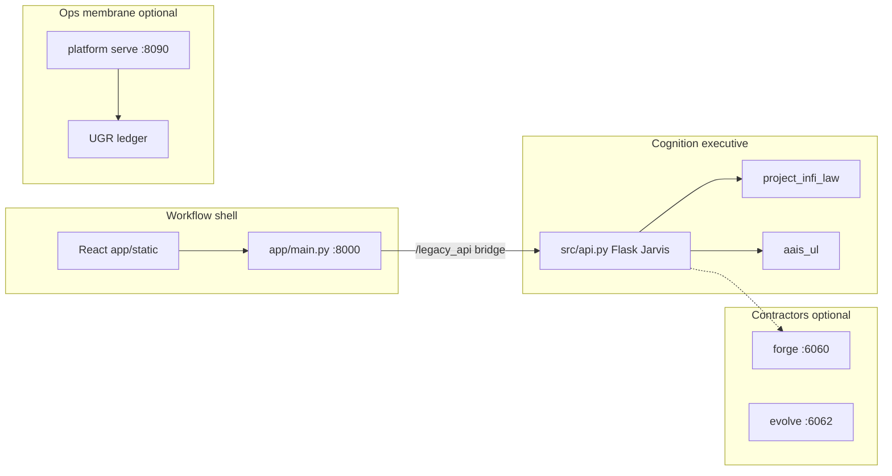

# Project Infinity — AAIS

> **Adaptive Authority Intelligence System (AAIS)** — a law-governed Jarvis runtime with inspectable Universal Language (UL) structure, Project Infi admission, and operator-facing surfaces.

## What AAIS Is

AAIS is not a single chatbot wrapper. It is a **governed cognition runtime** that:

- routes operator turns through **Jarvis** (`src/api.py`, `src/jarvis_operator.py`)
- adapts every outward payload through **AAIS-UL** (structure + visibility before expansion)
- enforces **Project Infi law** on chat replies, forge contractors, and repo mutations
- stages work on the **CISIV** ladder: concept → identity → structure → implementation → verification
- exposes traces, law enforcement, and UL substrate envelopes on live API responses

Think of it in three cooperating layers:

| Layer | Role | Key modules |
|---|---|---|
| **Authority shell** | Sessions, chat, tools, forge handoffs, operator UI | `src/api.py`, `app/main.py`, `aais/launcher.py` |
| **UL substrate** | Payload adaptation, modular previews, drift/smoke tooling | `src/aais_ul.py`, `src/chat_turn_governance.py`, `src/forge_repo_governance.py` |
| **Governed law** | Admission, repo change cycles, module governance | `src/project_infi_law.py`, `src/project_infi_state_machine.py` |

Authoritative references:

- Subsystem map: [`docs/runtime/AAIS_SUBSYSTEM_SPEC.md`](docs/runtime/AAIS_SUBSYSTEM_SPEC.md)
- UL doctrine: [`docs/contracts/AAIS_UL_DOCTRINE.md`](docs/contracts/AAIS_UL_DOCTRINE.md)
- Latest UL/CISIV proof: [`docs/proof/aais-ul/UL_CISIV_PHASES_1_5_PROOF.md`](docs/proof/aais-ul/UL_CISIV_PHASES_1_5_PROOF.md)

This repository is also **Project Infi** — constitutional engineering where claims require proof, not intent.

**License:** [Apache 2.0](LICENSE) · **Latest release:** [v1.3.1 — Close Loops](https://github.com/warheart1984-ctrl/Project-Infinity1/releases/tag/v1.3.1) · **Release history:** [CHANGELOG.md](CHANGELOG.md) · **Onboarding:** [First-Time Operator Guide](docs/operations/FIRST_TIME_OPERATOR_GUIDE.md)

---

## Architecture

AAIS separates **cognition authority**, **workflow shell**, and **optional ops planes**. Jarvis runtime truth lives in Flask (`src/api.py`); the FastAPI shell (`app/main.py`) hosts the operator UI and bridges to Jarvis at `/legacy_api`.



### Authority boundaries

| Plane | Owner | Role |
|---|---|---|
| **Cognition executive** | `src/api.py` | Jarvis sessions, chat turns, law admission, provider routing |
| **Workflow shell** | `app/main.py` | Health, onboarding, static UI, Celery workflow — does not replace Jarvis |
| **Ops membrane** | `platform/` | Multi-tenant jobs, ledger, artifacts — observe/actuate, not goal invention |
| **Contractors** | `forge/`, `forge_eval/`, `evolve_engine/` | Isolated HTTP lanes for repo mutation and evaluation |

### Request path (operator chat)

1. Operator turn enters `/legacy_api/api/chat/...` (Flask Jarvis).
2. **Chat turn governance** and **AAIS-UL substrate** adapt the outward payload.
3. **Project Infi law** admits or filters the reply.
4. **Provider registry** routes to mock, laptop, local, OpenAI, Anthropic, or OpenRouter.
5. Response includes `ul_substrate`, `modular_preview`, `law_enforcement`, and `cisiv_stage`.

Optional subsystems (Platform, Wolf-CoG-OS ISO forge, forge/evolve contractors) attach at the edges — core chat works without them.

Deep dives: [`docs/runtime/AAIS_SUBSYSTEM_SPEC.md`](docs/runtime/AAIS_SUBSYSTEM_SPEC.md), [`docs/operations/FULL_STACK_PILOT_INTEGRATION.md`](docs/operations/FULL_STACK_PILOT_INTEGRATION.md).

### Alt-3 partial-live subsystems (v0.3.0)

Three archive families from Audit Alt-3 are now **partial live** — governed MVPs with API routes, capability bridge actions, UL lineage, and proof packets:

| Subsystem | Capability bridge | Key API | Proof |
|---|---|---|---|
| **Recipe Module** | `recipe_module` / `create_mission` | `POST /api/jarvis/missions/from-recipe` | [RECIPE_MODULE_V1_PROOF](docs/proof/platform/RECIPE_MODULE_V1_PROOF.md) |
| **Imagine Generator** | `imagine_generator` / `emit`, `handoff`, `grok_render` | `POST /api/jarvis/imagine/emit`, `/handoff`, `/grok-render`; `GET .../keys-status` | [IMAGINE_GENERATOR_V1_PROOF](docs/proof/storyforge/IMAGINE_GENERATOR_V1_PROOF.md) |
| **Human Voice Extraction** | `human_voice_extraction` / `extract`, `signoff`, `handoff` | `POST /api/jarvis/human-voice/extract`, `/signoff`, `/handoff` | [HUMAN_VOICE_EXTRACTION_V1_PROOF](docs/proof/speakers/HUMAN_VOICE_EXTRACTION_V1_PROOF.md) |

Grok imagine render requires `STORY_FORGE_XAI_API_KEY` or `XAI_API_KEY` in the environment (no request-body keys). Active docs: [RECIPE_MODULE](docs/subsystems/platform/RECIPE_MODULE.md), [IMAGINE_GENERATOR](docs/subsystems/storyforge/IMAGINE_GENERATOR.md), [HUMAN_VOICE_EXTRACTION](docs/subsystems/speakers/HUMAN_VOICE_EXTRACTION.md).

**Verification:**

```bash
make alt3-gate
# or: python .github/scripts/check-recipe-module-governance.py
#     python .github/scripts/check-imagine-generator-governance.py
#     python .github/scripts/check-human-voice-extraction-governance.py
```

### Infinity 1 — Governance runtime and constitutional layer (v1.3.0)

Self-governing AAIS with executable **Alt-4 lifecycle organs**, **fifteen governed subsystem genomes**, **Tier 5** adaptive governance, **Alt-5** summon waves 1–2, **Alt-6** adaptive lane fabric, and **Alt-7** operator–cognition coherence fabric.

| Track | Subsystems | Key surfaces |
|---|---|---|
| **Golden batch (6)** | Lineage console, triangulation, NTP, recipe, imagine, human voice | Alt-3 gates + bridge actions |
| **Barebones wave (3)** | Capability Service Bridge, Jarvis Memory Board, Governed Direct Pipeline | `GET /api/jarvis/capability-bridge/status`, `GET /api/jarvis/memory/board`, `GET /api/jarvis/pipeline/{turn_id}` |
| **Alt-5 wave 1 (2)** | Safety Envelope Organ, Operator Profile Organ | `GET /api/jarvis/safety-envelope/status`, `GET /api/jarvis/operator-profile` |
| **Alt-5 wave 2 (2)** | Reflection Runtime Organ, Memory Runtime Organ | `GET /api/jarvis/reflection-runtime/status`, `GET /api/jarvis/memory-runtime/status` |
| **Alt-6 (1)** | Adaptive Lane Organ | `GET /api/jarvis/adaptive-lanes/status` |
| **Alt-7 (1)** | Operator Cognition Coherence Fabric | `GET /api/jarvis/coherence-fabric/status` |

Promotion scripts: `tools/governance/alt5_promote_wave2_mvp.py`, `alt5_promote_governed.py`, `barebones_promote_governed.py`, `alt6_promote_governed.py`, `alt7_promote_governed.py`.

**Verification:**

```bash
make genome-gate alt4-gate alt5-gate barebones-gate tier5-gate alt6-governed-gate alt7-governed-gate
python -m pytest tests/test_governance_organs_alt4.py tests/test_adaptive_governance.py \
  tests/test_adaptive_lane_organ.py tests/test_alt6_governed_eligibility.py \
  tests/test_adaptive_lane_bridge.py tests/test_coherence_fabric_bridge.py \
  tests/test_alt7_governed_eligibility.py tests/test_operator_cognition_coherence_fabric.py \
  tests/test_safety_envelope_organ.py tests/test_operator_profile_organ.py \
  tests/test_reflection_runtime_organ.py tests/test_memory_runtime_organ.py -q
```

Operator guide: [AAIS_ALT4_RUNTIME_OPERATOR_GUIDE](docs/contracts/AAIS_ALT4_RUNTIME_OPERATOR_GUIDE.md) · Adaptive law: [AAIS_ADAPTIVE_GOVERNANCE](docs/contracts/AAIS_ADAPTIVE_GOVERNANCE.md) · Adaptive lanes: [ADAPTIVE_LANE_ORGAN](docs/subsystems/platform/ADAPTIVE_LANE_ORGAN.md) · Coherence fabric: [OPERATOR_COGNITION_COHERENCE_FABRIC](docs/subsystems/platform/OPERATOR_COGNITION_COHERENCE_FABRIC.md) · Genome registry: [governance/subsystem_genomes/README.md](governance/subsystem_genomes/README.md)

> **v1.0.0** shipped the initial Infinity 1 slice (Alt-4, Tier 5, Alt-5 wave 1 at MVP). **v1.1.0** completes the constitutional layer (barebones wave + Alt-5 wave 2). **v1.2.0** adds Alt-6 adaptive lanes at `governed`. **v1.3.0** adds Alt-7 coherence fabric with cross-plane bridge enforcement.

### Three Ideas MVP partial-live subsystems (v0.4.0)

Three repo-grounded ideas promoted from concept to **partial live** — runtime modules, governance gates, and proof packets:

| Subsystem | Capability bridge | Key API | Proof |
|---|---|---|---|
| **CISIV Lineage Console** | — | `GET /api/jarvis/lineage/<mission_id>`; Operator → CISIV Lineage panel | [UL_LINEAGE_CONSOLE_V1_PROOF](docs/proof/aais-ul/UL_LINEAGE_CONSOLE_V1_PROOF.md) |
| **Forensic Triangulation** | `forensic_triangulation` / `correlate` | `POST /api/jarvis/triangulation/correlate` | [TRIANGULATION_V1_PROOF](docs/proof/forensics/TRIANGULATION_V1_PROOF.md) |
| **Narrative Trust Pack** | `narrative_trust_pack` / `pack`, `verify`, `signoff` | `POST /api/jarvis/narrative/pack`, `/verify`, `/signoff` | [NARRATIVE_TRUST_PACK_V1_PROOF](docs/proof/storyforge/NARRATIVE_TRUST_PACK_V1_PROOF.md) |

Active docs: [UL_LINEAGE_CONSOLE](docs/runtime/UL_LINEAGE_CONSOLE.md), [TRIANGULATION](docs/subsystems/forensics/TRIANGULATION.md), [NARRATIVE_TRUST_PACK](docs/subsystems/storyforge/NARRATIVE_TRUST_PACK.md).

**Verification:**

```bash
make lineage-gate triangulation-gate narrative-gate
python -m pytest tests/test_ul_lineage.py tests/test_triangulation.py tests/test_narrative_trust_pack.py -q
python -m tools.ul.smoke --lineage-graph tools/ul/fixtures/lineage_multi_hop.json --no-pytest
```

---

## How to start operations

| Path | Time | Start here | Outcome |
|---|---|---|---|
| **Tier 1 — AAIS local** | ~10 min | [First-Time Operator Guide §1](docs/operations/FIRST_TIME_OPERATOR_GUIDE.md#tier-1-run-aais-locally-10-minutes) + steps below | Mock Jarvis on `:8000` |
| **Tier 2 — Infinity Pilot** | ~15 min | [Guide §2](docs/operations/FIRST_TIME_OPERATOR_GUIDE.md#tier-2-infinity-pilot-docker-15-minutes) + [Early Adopter Guide](docs/operations/INFINITY_PILOT_EARLY_ADOPTER.md) | Docker stack: Platform + UGR + AAIS |
| **Tier 3 — Full monorepo** | Advanced | [Guide §3](docs/operations/FIRST_TIME_OPERATOR_GUIDE.md#tier-3-advanced-subsystems) + [Wolf-CoG-OS forge](wolf-cog-os/forge/README.md) | ISO forge, Platform v6+, subsystems |

### Prerequisites

- **Python 3.10+**
- **Git**
- **Node.js 18+** and **npm** — only if you need to rebuild the frontend (`frontend/`)
- Optional: **Redis** — for Celery background jobs (`make worker`)
- Optional: provider API keys — OpenAI / Anthropic (local/mock presets work without them)

### Initialization Steps

#### Clone and install

```bash
git clone https://github.com/warheart1984-ctrl/Project-Infinity1.git
cd Project-Infinity1
python -m pip install -e ".[dev]"
```

Copy environment template and set keys only for routes you use:

```bash
cp .env.example .env
# Edit .env — OPENAI_API_KEY / ANTHROPIC_API_KEY optional for mock or laptop presets
```

#### Prepare runtime data (first run)

```bash
python -m aais prepare --data-dir ./.runtime/aais-data
python -m aais doctor --data-dir ./.runtime/aais-data
```

`prepare` stages the packaged UI into `app/static/`. A prebuilt bundle ships with the repo; use `--force-build` only after `npm install` in `frontend/`.

### Operational Entry Point

#### Start AAIS

**Recommended (cross-platform launcher):**

```bash
python -m aais start --data-dir ./.runtime/aais-data --preset mock --no-browser
```

Presets (`src/main.py`):

| Preset | Use when |
|---|---|
| `mock` | No GPU / no API keys — deterministic local replies |
| `laptop` | Lightweight real local model path |
| `default` | Full runtime (may load heavier local models) |

**Developer alternative (uvicorn directly):**

```bash
make run
# equivalent: uvicorn app.main:app --reload
```

#### Open operator surfaces

| Surface | URL |
|---|---|
| Health | http://127.0.0.1:8000/health |
| App shell | http://127.0.0.1:8000/app |
| Jarvis console | http://127.0.0.1:8000/app/jarvis |
| Legacy Jarvis API (Flask) | mounted at `/legacy_api` via FastAPI bridge |

### Verification Step

```bash
curl -fsS http://127.0.0.1:8000/health
```

Create a chat session and send a message:

```bash
curl -fsS -X POST http://127.0.0.1:8000/legacy_api/api/chat/sessions \
  -H "Content-Type: application/json" \
  -d "{\"system_prompt\":\"You are Jarvis.\"}"

# Use session_id from response:
curl -fsS -X POST http://127.0.0.1:8000/legacy_api/api/chat/sessions/<session_id>/message \
  -H "Content-Type: application/json" \
  -d "{\"message\":\"Summarize AAIS.\",\"response_mode\":\"operator\"}"
```

A healthy turn returns `ul_substrate`, `modular_preview`, `law_enforcement`, and `cisiv_stage` on the payload.

**UL governance smoke:**

```bash
python -m tools.ul.drift
python -m tools.ul.smoke
python -m pytest tests/test_cisiv.py tests/test_chat_turn_governance.py tests/test_forge_repo_governance.py -q
```

**Alt-3 subsystem gate (v0.3.0+):**

```bash
make alt3-gate
```

**Three Ideas MVP gates (v0.4.0+):**

```bash
make lineage-gate triangulation-gate narrative-gate
```

### 6. Optional contractor lanes

These are isolated HTTP services — start only when you need forge/evolve features:

| Service | Default port | Env var |
|---|---|---|
| Forge contractor | 6060 | `FORGE_BASE_URL` |
| ForgeEval | 6061 | `FORGE_EVAL_BASE_URL` |
| EvolveEngine | 6062 | `EVOLVE_BASE_URL` |

Without them, core chat and patch-review paths still work; explicit forge routes return routing errors until the contractor is up.

### Failsafe Notes

- Stop foreground runtime with `Ctrl+C`.
- Do not delete `.runtime/aais-data` during active sessions.
- Missing proof or constitutional ambiguity is a **stop condition** — see governance section below.

---

## GitHub

| Item | Location |
|---|---|
| Repository | https://github.com/warheart1984-ctrl/Project-Infinity1 |
| Latest tag | [`v1.3.1`](https://github.com/warheart1984-ctrl/Project-Infinity1/releases/tag/v1.3.1) — **Close Loops** — MP-ALO-001 + MP-NTP-001 live, Triangulation/NTP Jarvis routes |
| Prior tag | [`v1.3.0`](https://github.com/warheart1984-ctrl/Project-Infinity1/releases/tag/v1.3.0) — Infinity 1 · Alt-7 — 15 governed genomes, coherence fabric, bridge enforcement |
| Earlier | [`v1.2.0`](https://github.com/warheart1984-ctrl/Project-Infinity1/releases/tag/v1.2.0) — Infinity 1 · Alt-6 — 14 governed genomes, adaptive lanes fabric, Tier 5 wake |
| Earlier | [`v1.1.0`](https://github.com/warheart1984-ctrl/Project-Infinity1/releases/tag/v1.1.0) — Infinity 1 (complete) — 13 governed genomes, Alt-5 waves 1–2, barebones wave |
| Earlier | [`v1.0.0`](https://github.com/warheart1984-ctrl/Project-Infinity1/releases/tag/v1.0.0) — Infinity 1 initial (Alt-4, Tier 5, Alt-5 wave 1 MVP) |
| Earlier | [`v0.4.0`](https://github.com/warheart1984-ctrl/Project-Infinity1/releases/tag/v0.4.0) — Three Ideas MVP (Lineage, Triangulation, NTP) |
| Prior | [`v0.3.0`](https://github.com/warheart1984-ctrl/Project-Infinity1/releases/tag/v0.3.0) — Audit Alt-3 partial-live (Recipe, Imagine, Human Voice) |
| Initial tag | [`v0.2.0`](https://github.com/warheart1984-ctrl/Project-Infinity1/releases/tag/v0.2.0) — initial public AAIS release |
| License | [LICENSE](LICENSE) (Apache 2.0) |
| Changelog | [CHANGELOG.md](CHANGELOG.md) |
| Security | [SECURITY.md](SECURITY.md) |
| Contributing | [`CONTRIBUTING.md`](CONTRIBUTING.md) |
| CI workflows | [`.github/workflows/`](.github/workflows/) |
| Local-only rules | [`.gitignore`](.gitignore), [`docs/GITHUB.md`](docs/GITHUB.md) |

Pull requests to `main` run governance gates (CoGOS CI, documentation baseline, UGR trust bundle, operator console, Forgekeeper, Scorpion). Significant claims in PRs must include proof posture (`asserted` / `proven` / `rejected`) per [`REPO_PROOF_LAW.md`](REPO_PROOF_LAW.md).

**Do not commit:** ISO images, `.runtime/`, `wolf-cog-os/output/`, or duplicate import folders (`*-main/`).

---

## Repository Layout (operator view)

```
aais/              Cross-platform launcher (start | prepare | doctor)
app/               FastAPI workflow shell + packaged static UI
src/               Jarvis runtime authority (api, operator, UL, law)
frontend/          React operator UI source (build → app/static)
forge/             Isolated Forge contractor service
platform/          Multi-tenant Platform Membrane (ops ingress :8090)
wolf-cog-os/       CoGOS ISO/rootfs forge (scripts tracked; outputs local-only)
deploy/            Docker compose stacks (pilot | platform | ugr)
tools/ul/          UL drift + smoke verification (+ lineage graph smoke)
tools/narrative/   Narrative Trust Pack CLI (pack | verify | signoff)
triangulation/     Forensic Triangulation correlator (Mechanic + Scorpion + Slingshot)
tools/recipe/      Recipe Module CLI + fixtures
tools/imagine/     Imagine Generator fixtures
tools/human_voice/ Human Voice Extraction fixtures
tools/governance/  SSP completeness and genome gates
docs/              Contracts, subsystem spec, proof packets
tests/             Pytest suite
external/          Vendored third-party integrations (see each package)
```

---

## Constitutional Governance

Behavior is constitutional, not aspirational. No fix, test, or release claim is complete without evidence.

**Precedence:** Law > Blueprint > Contract > Implementation > Pipeline > Tool

Governance references:

- [`META_ARCHITECT_LAWBOOK.md`](META_ARCHITECT_LAWBOOK.md)
- [`REPO_PROOF_LAW.md`](REPO_PROOF_LAW.md)
- [`HUMAN_AI_CO_COLLABORATION_CHARTER.md`](HUMAN_AI_CO_COLLABORATION_CHARTER.md)
- [`docs/TRUST_BUNDLE_SPEC.md`](docs/TRUST_BUNDLE_SPEC.md)

| Role | Responsibility |
|---|---|
| **Human** | Define law, approve exceptions, review evidence, hold release authority |
| **AI / agents** | Execute within law, emit traceable evidence, label claims (`asserted`, `proven`, `rejected`) |

### Doctrine summary (twelve doctrines)

| # | Doctrine | Intent |
|---|---|---|
| I | Proof-of-Reality | If it was not proven, it did not occur. |
| II | Blueprint | Intent documented before or with implementation change. |
| III | Documentation | Operation without current docs is non-compliant. |
| IV | Failsafe | Safe defaults, rollback, recovery, stop conditions. |
| V | Evidence | Claims require traceable proof artifacts. |
| VI | Debt | Gaps tracked with owner, severity, due date, status. |
| VII | CI Governance | Governance gates are mandatory acceptance controls. |
| VIII | Precedence | Higher-order artifacts govern conflicts. |
| IX | Change-of-Reality | Behavior changes require doc + test + proof updates. |
| X | Meta Architect Authority | Final constitutional interpretation is binding. |
| XI | Simple Trust | Evidence-first; trust bundles; human escalation when needed. |
| XII (MA-12) | Operational Primer | README must include **How to Make It Work** (this section). |

Templates: [`templates/PROOF_BUNDLE_TEMPLATE.md`](templates/PROOF_BUNDLE_TEMPLATE.md), [`templates/PROJECT_BASELINE_CHECKLIST.md`](templates/PROJECT_BASELINE_CHECKLIST.md)

---

## Contributor Oath

1. I will not present unproven claims as complete.
2. I will attach traceable evidence to significant fix/test/release claims.
3. I will preserve constitutional precedence and no-bypass governance.
4. I will track documentation/governance debt instead of hiding it.
5. I will treat missing evidence as a stop condition, not a paperwork delay.

---

## Contributors

See [`CONTRIBUTORS.md`](CONTRIBUTORS.md).

- **Jon Halstead** — maintainer and constitutional authority
- **Cursor Agent (Auto)** — AI implementation collaborator (UL/CISIV Phases 1–5, governance modules, proof bundles, operational README; commits `7b4e806`, `b086b1e`)

Human–AI collaboration follows [`HUMAN_AI_CO_COLLABORATION_CHARTER.md`](HUMAN_AI_CO_COLLABORATION_CHARTER.md).
