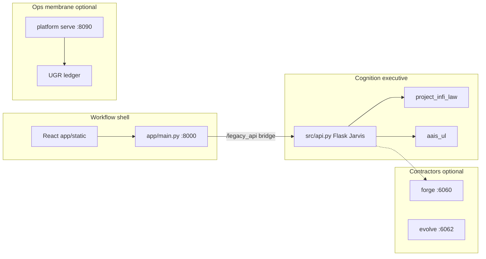

# Project Infinity — AAIS

> **Adaptive Authority Intelligence System (AAIS)** — a law-governed Jarvis runtime with inspectable Universal Language (UL) structure, Project Infi admission, and operator-facing surfaces.

## What AAIS Is

AAIS is not a single chatbot wrapper. It is a **governed cognition runtime** that:

- routes operator turns through **Jarvis** (`src/api.py`, `src/jarvis_operator.py`)
- adapts every outward payload through **AAIS-UL** (structure + visibility before expansion)
- enforces **Project Infi law** on chat replies, forge contractors, and repo mutations
- stages work on the **CISIV** ladder: concept → identity → structure → implementation → verification
- exposes traces, law enforcement, and UL substrate envelopes on live API responses

Think of it in three cooperating layers:

| Layer | Role | Key modules |
|---|---|---|
| **Authority shell** | Sessions, chat, tools, forge handoffs, operator UI | `src/api.py`, `app/main.py`, `aais/launcher.py` |
| **UL substrate** | Payload adaptation, modular previews, drift/smoke tooling | `src/aais_ul.py`, `src/chat_turn_governance.py`, `src/forge_repo_governance.py` |
| **Governed law** | Admission, repo change cycles, module governance | `src/project_infi_law.py`, `src/project_infi_state_machine.py` |

Authoritative references:

- Subsystem map: [`docs/runtime/AAIS_SUBSYSTEM_SPEC.md`](docs/runtime/AAIS_SUBSYSTEM_SPEC.md)
- UL doctrine: [`docs/contracts/AAIS_UL_DOCTRINE.md`](docs/contracts/AAIS_UL_DOCTRINE.md)
- Latest UL/CISIV proof: [`docs/proof/aais-ul/UL_CISIV_PHASES_1_5_PROOF.md`](docs/proof/aais-ul/UL_CISIV_PHASES_1_5_PROOF.md)

This repository is also **Project Infi** — constitutional engineering where claims require proof, not intent.

### Terminology (Project Infinity)

Architecture is unchanged; documentation and gates use standard engineering language. Legacy repo identifiers (`*_organ`, `*.genome.v1.json`, `altN-summon-wave`) remain for compatibility.

| Legacy (code/paths) | Standard language |
|---------------------|-------------------|
| Organ | **Subsystem** |
| Genome | **Schema** (registry: `governance/subsystem_genomes/`) |
| Surface | **Interface** |
| Plane / posture array | **Layer** |
| Fabric | **Coherence Layer** |
| Summon wave | **Release** |

**Linguistic naming schema** — each governed subsystem schema carries mythic and engineering names on its SSP block (169 genomes at **v1.24.0**, 163 governed at Release 27):

| SSP field | Example (Release 22) | Role |
|-----------|----------------------|------|
| `gene` | `linguistic_governance_attestation_organ` | Stable registry id (legacy path stem) |
| `engineering_class` | `LinguisticGovernanceAttestationEngine` | PascalCase `<Domain><Function><Role>` in code |
| `mythic_label` | Linguistic Governance Attestation Organ | Operator-facing mythic name in docs/comments |
| `linguistic_version` | `1.0.0` | Bump when MP-X changes mythic/engineering text |

Snapshots: [governance/linguistic_snapshots/](governance/linguistic_snapshots/) · schema [linguistic_snapshot.v1.json](schemas/linguistic_snapshot.v1.json) · grandfathered aliases: [legacy_engineering_aliases.v1.json](governance/legacy_engineering_aliases.v1.json).

```bash
make naming-gate naming-genome-gate meta-linguistic-gate   # Codex lint + genome alignment + meta orchestration
make translate-mythic MYTHIC='V9 runtime steward'   # mythic → engineering_class helper
```

**Codex / Cursor naming (new code):** [AAIS_CODEX_CURSOR_NAMING_PROTOCOL.md](docs/contracts/AAIS_CODEX_CURSOR_NAMING_PROTOCOL.md) · **Meta-linguistic governance:** [AAIS_META_LINGUISTIC_GOVERNANCE.md](docs/contracts/AAIS_META_LINGUISTIC_GOVERNANCE.md) — mythic in comments, engineering in identifiers; legacy `*_organ` / `*_fabric` paths grandfathered until Wave 4 MP-X rename.

**License:** [Apache 2.0](LICENSE) · **Latest release:** [v1.24.0 — Release 28 Story Forge Expansion Fabric](https://github.com/warheart1984-ctrl/Project-Infinity1/releases/tag/v1.24.0) (tag on GitHub) · **Release history:** [CHANGELOG.md](CHANGELOG.md) · **Onboarding:** [First-Time Operator Guide](docs/operations/FIRST_TIME_OPERATOR_GUIDE.md)

---

## Architecture

AAIS separates **cognition authority**, **workflow shell**, and **optional ops planes**. Jarvis runtime truth lives in Flask (`src/api.py`); the FastAPI shell (`app/main.py`) hosts the operator UI and bridges to Jarvis at `/legacy_api`.



### Authority boundaries

| Plane | Owner | Role |
|---|---|---|
| **Cognition executive** | `src/api.py` | Jarvis sessions, chat turns, law admission, provider routing |
| **Workflow shell** | `app/main.py` | Health, onboarding, static UI, Celery workflow — does not replace Jarvis |
| **Ops membrane** | `platform/` | Multi-tenant jobs, ledger, artifacts — observe/actuate, not goal invention |
| **Contractors** | `forge/`, `forge_eval/`, `evolve_engine/` | Isolated HTTP lanes for repo mutation and evaluation |

### Request path (operator chat)

1. Operator turn enters `/legacy_api/api/chat/...` (Flask Jarvis).
2. **Chat turn governance** and **AAIS-UL substrate** adapt the outward payload.
3. **Project Infi law** admits or filters the reply.
4. **Provider registry** routes to local, mock/laptop, or any configured frontier adapter (OpenAI, Claude, Gemini, Nemotron, OpenRouter, and others — see [Installing API keys](#installing-api-keys-frontier-models)).
5. Response includes `ul_substrate`, `modular_preview`, `law_enforcement`, and `cisiv_stage`.

Optional subsystems (Platform, Wolf-CoG-OS ISO forge, forge/evolve contractors) attach at the edges — core chat works without them.

Deep dives: [`docs/runtime/AAIS_SUBSYSTEM_SPEC.md`](docs/runtime/AAIS_SUBSYSTEM_SPEC.md), [`docs/operations/FULL_STACK_PILOT_INTEGRATION.md`](docs/operations/FULL_STACK_PILOT_INTEGRATION.md).

### Alt-3 partial-live subsystems (v0.3.0)

Three archive families from Audit Alt-3 are now **partial live** — governed MVPs with API routes, capability bridge actions, UL lineage, and proof packets:

| Subsystem | Capability bridge | Key API | Proof |
|---|---|---|---|
| **Recipe Module** | `recipe_module` / `create_mission` | `POST /api/jarvis/missions/from-recipe` | [RECIPE_MODULE_V1_PROOF](docs/proof/platform/RECIPE_MODULE_V1_PROOF.md) |
| **Imagine Generator** | `imagine_generator` / `emit`, `handoff`, `grok_render` | `POST /api/jarvis/imagine/emit`, `/handoff`, `/grok-render`; `GET .../keys-status` | [IMAGINE_GENERATOR_V1_PROOF](docs/proof/storyforge/IMAGINE_GENERATOR_V1_PROOF.md) |
| **Human Voice Extraction** | `human_voice_extraction` / `extract`, `signoff`, `handoff` | `POST /api/jarvis/human-voice/extract`, `/signoff`, `/handoff` | [HUMAN_VOICE_EXTRACTION_V1_PROOF](docs/proof/speakers/HUMAN_VOICE_EXTRACTION_V1_PROOF.md) |

Grok imagine render requires `STORY_FORGE_XAI_API_KEY` or `XAI_API_KEY` in the environment (no request-body keys). Active docs: [RECIPE_MODULE](docs/subsystems/platform/RECIPE_MODULE.md), [IMAGINE_GENERATOR](docs/subsystems/storyforge/IMAGINE_GENERATOR.md), [HUMAN_VOICE_EXTRACTION](docs/subsystems/speakers/HUMAN_VOICE_EXTRACTION.md).

**Verification:**

```bash
make alt3-gate
# or: python .github/scripts/check-recipe-module-governance.py
#     python .github/scripts/check-imagine-generator-governance.py
#     python .github/scripts/check-human-voice-extraction-governance.py
```

### Infinity 1 — Governance runtime and constitutional layer (v1.3.0)

Self-governing AAIS with executable **Alt-4 lifecycle subsystems**, **one hundred thirty-eight governed subsystem schemas**, **Tier 5** adaptive governance, **Alt-5** releases 1–2, **Alt-6** adaptive lane Coherence Layer, **Alt-7** operator–cognition coherence layer, **Alt-8** mind-plane subsystems, **Alt-9** infrastructure layer, **Alt-10** memory/forensics/immune observe layer, **Alt-11** authority trace/boundary/coding layer, **Alt-12** OTEM/predictive/execution-depth layer, **Alt-13** creative chain/constitutional closure layer, **Alt-14** route choice/perception layer, **Alt-15** Nova cortex lobe and voice layer, **Alt-16** factory and kinetic layer, **Alt-17** authority shell and protocol layer, **Alt-18** Project Infi law layer, **Alt-19** operator product interfaces, **Release 20** operator workspace and extended interfaces, **Release 21** creative runtime V9/V10 fabric, and **Release 22** meta-linguistic governance fabric.

| Track | Subsystems | Key surfaces |
|---|---|---|
| **Golden batch (6)** | Lineage console, triangulation, NTP, recipe, imagine, human voice | Alt-3 gates + bridge actions |
| **Barebones wave (3)** | Capability Service Bridge, Jarvis Memory Board, Governed Direct Pipeline | `GET /api/jarvis/capability-bridge/status`, `GET /api/jarvis/memory/board`, `GET /api/jarvis/pipeline/{turn_id}` |
| **Alt-5 wave 1 (2)** | Safety Envelope Organ, Operator Profile Organ | `GET /api/jarvis/safety-envelope/status`, `GET /api/jarvis/operator-profile` |
| **Alt-5 wave 2 (2)** | Reflection Runtime Organ, Memory Runtime Organ | `GET /api/jarvis/reflection-runtime/status`, `GET /api/jarvis/memory-runtime/status` |
| **Alt-6 (1)** | Adaptive Lane Organ | `GET /api/jarvis/adaptive-lanes/status` |
| **Alt-7 (1)** | Operator Cognition Coherence Fabric | `GET /api/jarvis/coherence-fabric/status` |
| **Alt-8 (3)** | Continuity Witness, Narrative Continuity, Intent Agency | `GET /api/jarvis/continuity-witness/status`, `GET /api/jarvis/narrative-continuity/status`, `GET /api/jarvis/intent-agency/status` |
| **Alt-9 (3)** | Phase Gate, Realtime Predictor, Invariant Engine | `GET /api/jarvis/phase-gate/status`, `GET /api/jarvis/realtime-predictor/status`, `GET /api/jarvis/invariant-engine/status` |
| **Alt-10 (9)** | Verification Gate, Memory Path Governance, Knowledge Authority, Scorpion Bridge, Mechanic Handoff, Forensic Triangulation Organ, Immune Observe, Policy Gate, Predictor Immune Bridge | `GET /api/jarvis/verification-gate/status`, `GET /api/jarvis/memory-path-governance/status`, `GET /api/jarvis/knowledge-authority/status`, `GET /api/jarvis/scorpion-bridge/status`, `GET /api/jarvis/mechanic-handoff/status`, `GET /api/jarvis/forensic-triangulation/status`, `GET /api/jarvis/immune-observe/status`, `GET /api/jarvis/policy-gate/status`, `GET /api/jarvis/predictor-immune-bridge/status` |
| **Alt-11 (9)** | Cognitive Bridge, Governed Event Chain, Tracing Spine, Mission Board, ARIS Boundary, Capability Module, Patchforge, Change Scope, Patch Verification | `GET /api/jarvis/cognitive-bridge/status`, `GET /api/jarvis/governed-event-chain/status`, `GET /api/jarvis/tracing-spine/status`, `GET /api/jarvis/mission-board/status`, `GET /api/jarvis/aris-boundary/status`, `GET /api/jarvis/capability-module/status`, `GET /api/jarvis/patchforge/status`, `GET /api/jarvis/change-scope/status`, `GET /api/jarvis/patch-verification/status` |
| **Alt-12 (9)** | OTEM Bounded, Direct Challenge, Orchestration Spine, Operator Health Sentinel, Governed Realtime Lane, V8 Runtime, Patch Apply, Patch Execution Preview, Run Ledger | `GET /api/jarvis/otem-bounded/status`, `GET /api/jarvis/direct-challenge/status`, `GET /api/jarvis/orchestration-spine/status`, `GET /api/jarvis/operator-health-sentinel/status`, `GET /api/jarvis/governed-realtime-lane/status`, `GET /api/jarvis/v8-runtime/status`, `GET /api/jarvis/patch-apply/status`, `GET /api/jarvis/patch-execution-preview/status`, `GET /api/jarvis/run-ledger/status` |
| **Alt-13 (9)** | UL Lineage Console, Module Governance, Recipe Module, Imagine Generator, Story Forge Lane, Beatbox Lane, Speakers Lane, Human Voice Extraction, Narrative Trust Pack | `GET /api/jarvis/ul-lineage-console/status`, `GET /api/jarvis/module-governance/status`, `GET /api/jarvis/recipe-module/status`, `GET /api/jarvis/imagine-generator/status`, `GET /api/jarvis/story-forge-lane/status`, `GET /api/jarvis/beatbox-lane/status`, `GET /api/jarvis/speakers-lane/status`, `GET /api/jarvis/human-voice-extraction/status`, `GET /api/jarvis/narrative-trust-pack/status` |
| **Alt-14 (9)** | Document Vision, UI Vision, Perception Gateway, Spatial Reasoning, Mystic Engine, Perception Lane, Route Choice, Specialist Route, Provider Route | `GET /api/jarvis/document-vision/status`, `GET /api/jarvis/ui-vision/status`, `GET /api/jarvis/perception-gateway/status`, `GET /api/jarvis/spatial-reasoning/status`, `GET /api/jarvis/mystic-engine/status`, `GET /api/jarvis/perception-lane/status`, `GET /api/jarvis/route-choice/status`, `GET /api/jarvis/specialist-route/status`, `GET /api/jarvis/provider-route/status` |
| **Alt-15 (9)** | Reasoning Executive, Attention, Coherence Projection, Deliberation, Planning, Cortex Arcs, Cognitive Execution, Speaking Runtime, Nova Face | `GET /api/jarvis/reasoning-executive/status`, `GET /api/jarvis/attention/status`, `GET /api/jarvis/coherence-projection/status`, `GET /api/jarvis/deliberation/status`, `GET /api/jarvis/planning/status`, `GET /api/jarvis/cortex-arcs/status`, `GET /api/jarvis/cognitive-execution/status`, `GET /api/jarvis/speaking-runtime/status`, `GET /api/jarvis/nova-face/status` |
| **Alt-16 (9)** | AI Factory, CoGOS Runtime Bridge, Wolf Rehydration, Forge Contractor, ForgeEval, Evolve Engine, Slingshot, Operator Workbench, Workflow Shell | `GET /api/jarvis/ai-factory/status`, `GET /api/jarvis/cogos-runtime-bridge/status`, `GET /api/jarvis/wolf-rehydration/status`, `GET /api/jarvis/forge-contractor/status`, `GET /api/jarvis/forge-eval/status`, `GET /api/jarvis/evolve-engine/status`, `GET /api/jarvis/slingshot/status`, `GET /api/jarvis/operator-workbench/status`, `GET /api/jarvis/workflow-shell/status` |
| **Alt-17 (9)** | Jarvis Protocol, Reasoning Contract, Jarvis Reasoning Lane, Conversation Memory, Continuity Substrate, Jarvis Operator, Anti-Drift, Prompt Assembly, Output Integrity | `GET /api/jarvis/jarvis-protocol/status`, `GET /api/jarvis/reasoning-contract/status`, `GET /api/jarvis/jarvis-reasoning-lane/status`, `GET /api/jarvis/conversation-memory/status`, `GET /api/jarvis/continuity-substrate/status`, `GET /api/jarvis/jarvis-operator/status`, `GET /api/jarvis/anti-drift/status`, `GET /api/jarvis/prompt-assembly/status`, `GET /api/jarvis/output-integrity/status` |
| **Alt-18 (9)** | Project Infi State Machine, Project Infi Law, Run Ledger Binding, Chat Turn Governance, AAIS UL Substrate, ARIS Integration, Governance Layer, Security Protocol, System Guard | `GET /api/jarvis/project-infi-state-machine/status`, `GET /api/jarvis/project-infi-law/status`, `GET /api/jarvis/run-ledger-binding/status`, `GET /api/jarvis/chat-turn-governance/status`, `GET /api/jarvis/aais-ul-substrate/status`, `GET /api/jarvis/aris-integration/status`, `GET /api/jarvis/governance-layer/status`, `GET /api/jarvis/security-protocol/status`, `GET /api/jarvis/system-guard/status` |
| **Alt-19 (9)** | Launcher, AAIS Doctor, Workflow Runtime, Jarvis Console Surface, Memory Bank Surface, Dashboard Surface, Nova Landing Surface, AAIS Composed Runtime, API Gateway | `GET /api/jarvis/launcher/status`, `GET /api/jarvis/aais-doctor/status`, `GET /api/jarvis/workflow-runtime/status`, `GET /api/jarvis/jarvis-console-surface/status`, `GET /api/jarvis/memory-bank-surface/status`, `GET /api/jarvis/dashboard-surface/status`, `GET /api/jarvis/nova-landing-surface/status`, `GET /api/jarvis/aais-composed-runtime/status`, `GET /api/jarvis/api-gateway/status` |
| **Release 20 (9)** | Memory Smith, Operator Workspace, Jarvis Runs, State Hygiene, Blueprint Posture, Workflow Interfaces, Platform Console Interfaces, Operator Console Interface, Nova Workspace Interface | `GET /api/jarvis/memory-smith/status`, `GET /api/jarvis/operator-workspace/status`, `GET /api/jarvis/jarvis-runs/status`, `GET /api/jarvis/state-hygiene/status`, `GET /api/jarvis/blueprint-posture/status`, `GET /api/jarvis/workflow-interfaces/status`, `GET /api/jarvis/platform-console-interfaces/status`, `GET /api/jarvis/operator-console-interface/status`, `GET /api/jarvis/nova-workspace-interface/status` |
| **Release 21 (9)** | Creative Core Runtime, V9 Core, V9 Runtime, V10 Core, V10 Runtime, V10 Action Engine, Creative Capability Bridge, Creative Operator Handoff, Creative Console Interface | `GET /api/jarvis/creative-core-runtime/status`, `GET /api/jarvis/v9-core/status`, `GET /api/jarvis/v9-runtime/status`, `GET /api/jarvis/v10-core/status`, `GET /api/jarvis/v10-runtime/status`, `GET /api/jarvis/v10-action-engine/status`, `GET /api/jarvis/creative-capability-bridge/status`, `GET /api/jarvis/creative-operator-handoff/status`, `GET /api/jarvis/creative-console-interface/status` |
| **Release 22 (9)** | Naming Protocol, Naming Genome, Linguistic Mutation, Mythic Engineering Translator, Linguistic Drift Predictor, Linguistic Lineage Viz, Linguistic Remediation, Linguistic Cascade, Meta-Linguistic Governance | `GET /api/jarvis/naming-protocol/status`, `GET /api/jarvis/naming-genome/status`, `GET /api/jarvis/linguistic-mutation/status`, `GET /api/jarvis/mythic-engineering-translator/status`, `GET /api/jarvis/linguistic-drift-predictor/status`, `GET /api/jarvis/linguistic-lineage-viz/status`, `GET /api/jarvis/linguistic-remediation/status`, `GET /api/jarvis/linguistic-cascade/status`, `GET /api/jarvis/meta-linguistic-governance/status` |
| **Release 25 (9)** | Linguistic Forecast Archive, Linguistic Drift Report, Linguistic Governance Work Order, Linguistic Governance Cadence, Linguistic Forecast Calibration Report, Linguistic Full Governance Cycle History, Meta-Linguistic Registry, Linguistic Subsystem Promotion, Linguistic Governed Lifecycle Fabric | `GET /api/jarvis/linguistic-forecast-archive/status`, `GET /api/jarvis/linguistic-drift-report/status`, `GET /api/jarvis/linguistic-governance-work-order/status`, `GET /api/jarvis/linguistic-governance-cadence/status`, `GET /api/jarvis/linguistic-forecast-calibration-report/status`, `GET /api/jarvis/linguistic-full-governance-cycle-history/status`, `GET /api/jarvis/meta-linguistic-registry/status`, `GET /api/jarvis/linguistic-subsystem-promotion/status`, `GET /api/jarvis/linguistic-governed-lifecycle-fabric/status` |
| **Release 26 (3)** | Linguistic Governance Day, Linguistic Work Order History, Linguistic Attestation History | `GET /api/jarvis/linguistic-governance-day/status`, `GET /api/jarvis/linguistic-work-order-history/status`, `GET /api/jarvis/linguistic-attestation-history/status` |
| **Release 27 (9)** | CISIV Lineage Console, Forensic Triangulation, Capability Bridge, Memory Board, Governed Pipeline, Recipe Module, Imagine Generator, Narrative Trust Pack, Human Voice Extraction | `GET /api/jarvis/ul-lineage-console/status`, `GET /api/jarvis/forensic-triangulation/status`, `GET /api/jarvis/capability-bridge/status`, `GET /api/jarvis/memory/board`, `GET /api/jarvis/pipeline/{turn_id}`, `GET /api/jarvis/recipe-module/status`, `GET /api/jarvis/imagine-generator/status`, `GET /api/jarvis/narrative-trust-pack/status`, `GET /api/jarvis/human-voice-extraction/status` |
| **Release 28 (6)** | Story Forge Launcher, Movie Renderer Lane, Text-Game-to-Video, Game Front Door, Text-to-3D World Lane, World Pack Lane | `GET /api/jarvis/story-forge-launcher/status`, `GET /api/jarvis/movie-renderer-lane/status`, `GET /api/jarvis/text-game-to-video/status`, `GET /api/jarvis/game-front-door/status`, `GET /api/jarvis/text-to-3d-world-lane/status`, `GET /api/jarvis/world-pack-lane/status` |

Promotion scripts: `tools/governance/alt5_promote_wave2_mvp.py`, `alt5_promote_governed.py`, `barebones_promote_governed.py`, `alt6_promote_governed.py`, `alt7_promote_governed.py`, `alt8_promote_mvp.py`, `alt8_promote_governed.py`, `alt9_promote_mvp.py`, `alt9_promote_governed.py`, `alt10_promote_mvp.py`, `alt10_promote_governed.py`, `alt11_promote_mvp.py`, `alt11_promote_governed.py`, `alt12_promote_mvp.py`, `alt12_promote_governed.py`, `alt13_promote_mvp.py`, `alt13_promote_governed.py`, `alt14_promote_mvp.py`, `alt14_promote_governed.py`, `alt15_promote_mvp.py`, `alt15_promote_governed.py`, `alt16_promote_mvp.py`, `alt16_promote_governed.py`, `alt17_promote_mvp.py`, `alt17_promote_governed.py`, `alt18_promote_mvp.py`, `alt18_promote_governed.py`, `alt19_promote_mvp.py`, `alt19_promote_governed.py`, `alt20_promote_mvp.py`, `alt20_promote_governed.py`, `alt21_promote_mvp.py`, `alt21_promote_governed.py`, `alt22_promote_mvp.py`, `alt22_promote_governed.py`, `alt25_promote_mvp.py`, `alt25_promote_governed.py`, `alt26_promote_mvp.py`, `alt26_promote_governed.py`, `alt27_promote_mvp.py`, `alt27_promote_governed.py`, `alt28_promote_mvp.py`, `alt28_promote_governed.py`.

**Verification:**

```bash
make genome-gate alt4-gate alt5-gate barebones-gate tier5-gate alt6-governed-gate alt7-governed-gate alt7-1-gate alt7-2-gate alt8-gate alt8-1-gate alt8-2-gate alt8-governed-gate alt9-gate alt9-1-gate alt9-2-gate alt9-governed-gate alt10-gate alt10-1-gate alt10-2-gate alt10-governed-gate alt11-gate alt11-1-gate alt11-2-gate alt11-governed-gate alt12-gate alt12-1-gate alt12-2-gate alt12-governed-gate alt13-gate alt13-1-gate alt13-2-gate alt13-governed-gate alt14-gate alt14-1-gate alt14-2-gate alt14-governed-gate alt15-gate alt15-1-gate alt15-2-gate alt15-governed-gate alt16-gate alt16-1-gate alt16-2-gate alt16-governed-gate alt17-gate alt17-1-gate alt17-2-gate alt17-governed-gate alt18-gate alt18-1-gate alt18-2-gate alt18-governed-gate alt19-gate alt19-1-gate alt19-2-gate alt19-governed-gate alt20-gate alt20-1-gate alt20-2-gate alt20-governed-gate alt21-gate alt21-1-gate alt21-2-gate alt21-governed-gate alt22-gate alt22-1-gate alt22-2-gate alt22-governed-gate
python -m pytest tests/test_governance_organs_alt4.py tests/test_adaptive_governance.py \
  tests/test_adaptive_lane_organ.py tests/test_alt6_governed_eligibility.py \
  tests/test_adaptive_lane_bridge.py tests/test_coherence_fabric_bridge.py \
  tests/test_alt7_governed_eligibility.py tests/test_operator_cognition_coherence_fabric.py \
  tests/test_continuity_witness_organ.py tests/test_narrative_continuity_organ.py tests/test_intent_agency_organ.py \
  tests/test_safety_envelope_organ.py tests/test_operator_profile_organ.py \
  tests/test_reflection_runtime_organ.py tests/test_memory_runtime_organ.py -q
```

Operator guide: [AAIS_ALT4_RUNTIME_OPERATOR_GUIDE](docs/contracts/AAIS_ALT4_RUNTIME_OPERATOR_GUIDE.md) · Adaptive law: [AAIS_ADAPTIVE_GOVERNANCE](docs/contracts/AAIS_ADAPTIVE_GOVERNANCE.md) · Adaptive lanes: [ADAPTIVE_LANE_ORGAN](docs/subsystems/platform/ADAPTIVE_LANE_ORGAN.md) · Coherence Layer: [OPERATOR_COGNITION_COHERENCE_FABRIC](docs/subsystems/platform/OPERATOR_COGNITION_COHERENCE_FABRIC.md) · Schema registry: [governance/subsystem_genomes/README.md](governance/subsystem_genomes/README.md) · Naming contract: [AAIS_CODEX_CURSOR_NAMING_PROTOCOL.md](docs/contracts/AAIS_CODEX_CURSOR_NAMING_PROTOCOL.md)

> **v1.0.0** shipped the initial Infinity 1 slice (Alt-4, Tier 5, Alt-5 wave 1 at MVP). **v1.1.0** completes the constitutional layer (barebones wave + Alt-5 wave 2). **v1.2.0** adds Alt-6 adaptive lanes at `governed`. **v1.3.0** adds Alt-7 coherence fabric with cross-plane bridge enforcement. **v1.4.0** adds Alt-8 mind-plane organs and coherence fabric v1.3. **v1.5.0** adds Alt-9 infrastructure organs and coherence fabric v1.4. **v1.6.0** adds Alt-10 memory/forensics/immune observe organs and coherence fabric v1.5. **v1.7.0** adds Alt-11 authority trace/boundary/coding organs and coherence fabric v1.6. **v1.8.0** adds Alt-12 OTEM/predictive/execution-depth organs and coherence fabric v1.7. **v1.9.0** adds Alt-13 creative chain/constitutional closure organs and coherence fabric v1.8. **v1.10.0** adds Alt-14 route choice/perception organs and coherence fabric v1.9. **v1.11.0** adds Alt-15 Nova cortex lobe and voice organs and coherence fabric v1.10. **v1.12.0** adds Alt-16 factory and kinetic organs and coherence fabric v1.11. **v1.13.0** adds Alt-17 authority shell and protocol organs and coherence fabric v1.12. **v1.14.0** adds Alt-18 Project Infi law organs and coherence fabric v1.13. **v1.15.0** adds Alt-19 operator product shell organs and coherence fabric v1.14. **v1.16.0** adds Release 20 operator workspace and extended interface subsystems and Coherence Layer v1.15. **v1.17.0** adds Release 21 creative runtime V9/V10 subsystems and Coherence Layer v1.16. **v1.18.0** adds Release 22 meta-linguistic governance subsystems, meta-linguistic gates (Waves 0–10), and Coherence Layer v1.17. **v1.19.0** adds Release 23 predictive linguistic cycle subsystems and Coherence Layer v1.18. **v1.20.0** adds Release 24 attested linguistic closed-loop subsystems, Wave 14 attestation engines, and Coherence Layer v1.19. **v1.21.0** adds Release 25 governed linguistic lifecycle fabric (nine organs) and Coherence Layer v1.20. **v1.22.0** adds Release 26 operational closure (three organs), Coherence Layer v1.21, Codex engineering headers, and cumulative stack gates with naming-gate at zero warnings.

### Three Ideas MVP partial-live subsystems (v0.4.0)

Three repo-grounded ideas promoted from concept to **partial live** — runtime modules, governance gates, and proof packets:

| Subsystem | Capability bridge | Key API | Proof |
|---|---|---|---|
| **CISIV Lineage Console** | — | `GET /api/jarvis/lineage/<mission_id>`; Operator → CISIV Lineage panel | [UL_LINEAGE_CONSOLE_V1_PROOF](docs/proof/aais-ul/UL_LINEAGE_CONSOLE_V1_PROOF.md) |
| **Forensic Triangulation** | `forensic_triangulation` / `correlate` | `POST /api/jarvis/triangulation/correlate` | [TRIANGULATION_V1_PROOF](docs/proof/forensics/TRIANGULATION_V1_PROOF.md) |
| **Narrative Trust Pack** | `narrative_trust_pack` / `pack`, `verify`, `signoff` | `POST /api/jarvis/narrative/pack`, `/verify`, `/signoff` | [NARRATIVE_TRUST_PACK_V1_PROOF](docs/proof/storyforge/NARRATIVE_TRUST_PACK_V1_PROOF.md) |

Active docs: [UL_LINEAGE_CONSOLE](docs/runtime/UL_LINEAGE_CONSOLE.md), [TRIANGULATION](docs/subsystems/forensics/TRIANGULATION.md), [NARRATIVE_TRUST_PACK](docs/subsystems/storyforge/NARRATIVE_TRUST_PACK.md).

**Verification:**

```bash
make lineage-gate triangulation-gate narrative-gate
python -m pytest tests/test_ul_lineage.py tests/test_triangulation.py tests/test_narrative_trust_pack.py -q
python -m tools.ul.smoke --lineage-graph tools/ul/fixtures/lineage_multi_hop.json --no-pytest
```

---

## How to start operations

| Path | Time | Start here | Outcome |
|---|---|---|---|
| **Tier 1 — AAIS local** | ~10 min | [First-Time Operator Guide §1](docs/operations/FIRST_TIME_OPERATOR_GUIDE.md#tier-1-run-aais-locally-10-minutes) + steps below | Mock Jarvis on `:8000` |
| **Tier 2 — Infinity Pilot** | ~15 min | [Guide §2](docs/operations/FIRST_TIME_OPERATOR_GUIDE.md#tier-2-infinity-pilot-docker-15-minutes) + [Early Adopter Guide](docs/operations/INFINITY_PILOT_EARLY_ADOPTER.md) | Docker stack: Platform + UGR + AAIS |
| **Tier 3 — Full monorepo** | Advanced | [Guide §3](docs/operations/FIRST_TIME_OPERATOR_GUIDE.md#tier-3-advanced-subsystems) + [Wolf-CoG-OS forge](wolf-cog-os/forge/README.md) | ISO forge, Platform v6+, subsystems |

### Prerequisites

- **Python 3.10+**
- **Git**
- **Node.js 18+** and **npm** — only if you need to rebuild the frontend (`frontend/`)
- Optional: **Redis** — for Celery background jobs (`make worker`)
- Optional: frontier provider API keys (local/mock presets work without them — see [Installing API keys](#installing-api-keys-frontier-models))

### Initialization Steps

#### Clone and install

```bash
git clone https://github.com/warheart1984-ctrl/Project-Infinity1.git
cd Project-Infinity1
python -m pip install -e ".[dev]"
```

Copy environment template and set keys only for providers you want:

```bash
cp .env.example .env
# Edit .env — see "Installing API keys" below; mock/laptop presets need no keys
```

### Installing API keys (frontier models)

Release 28 registers **every major frontier adapter** in the Jarvis provider picker. Adapters stay **off** until you add the matching key to `.env` and restart AAIS.

**Steps**

1. Copy the template: `cp .env.example .env`
2. Uncomment or set only the keys for providers you use (never commit `.env`).
3. Restart AAIS: `python -m aais start --data-dir ./.runtime/aais-data --preset default --no-browser`
4. Confirm in the UI or API:
   - `GET http://127.0.0.1:8000/legacy_api/api/jarvis/providers` — each entry shows `available: true` when configured
   - Set chat/session `preferred_provider` to the provider `id` (e.g. `openai`, `claude`, `nvidia`, `google`)

**Common keys** (full list in `.env.example` and [docs/providers/FRONTIER_MODEL_ADAPTERS.md](docs/providers/FRONTIER_MODEL_ADAPTERS.md)):

| Pick this provider | Set in `.env` | Notes |
|--------------------|---------------|--------|
| `local` | *(none)* | Default on-laptop path; use `--preset laptop` for small real model |
| `claude` | `ANTHROPIC_API_KEY` | Optional `AAIS_CLAUDE_MODEL` |
| `openai` | `OPENAI_API_KEY` | Optional `AAIS_OPENAI_MODEL` (default `gpt-4o-mini`) |
| `openrouter` | `OPENROUTER_API_KEY` | Free/paid routed models; `AAIS_OPENROUTER_MODEL` |
| `google` | `GOOGLE_API_KEY` or `GEMINI_API_KEY` | Gemini via OpenAI-compatible endpoint |
| `nvidia` | `NVIDIA_API_KEY` | **Nemotron 3 Nano** — [build.nvidia.com](https://build.nvidia.com); default `nvidia/nemotron-3-nano-30b-a3b` |
| `mistral` | `MISTRAL_API_KEY` | |
| `deepseek` | `DEEPSEEK_API_KEY` | |
| `xai` | `XAI_API_KEY` | Grok |
| `groq` | `GROQ_API_KEY` | Fast hosted open models |
| `perplexity` | `PERPLEXITY_API_KEY` | Sonar |
| `together` | `TOGETHER_API_KEY` | Model hub |
| `fireworks` | `FIREWORKS_API_KEY` | |
| `azure_openai` | `AZURE_OPENAI_API_KEY` + `AAIS_AZURE_OPENAI_ENDPOINT` + deployment name | |
| `moonshot` | `MOONSHOT_API_KEY` | Kimi |
| `ai21` | `AI21_API_KEY` | Jamba |

**NVIDIA Nemotron (new)** — Nemotron 3 Nano is the current open agentic frontier line; optional chain-of-thought: `AAIS_NVIDIA_ENABLE_THINKING=1`. Self-hosted NIM: set `AAIS_NVIDIA_BASE_URL` to your `http://host:8000/v1/chat/completions`.

**Mock dev (no keys)** — `--preset mock` uses `MockMultiModalAI`; frontier providers still appear in the list as unavailable until keyed.

**Optional chat speed** (after keys or for local mock):

```env
AAIS_COHERENCE_FABRIC_CACHE_SEC=45
AAIS_GOVERNED_PIPELINE_CACHE_SEC=45
AAIS_SLINGSHOT_CACHE_SEC=30
```

Set any cache to `0` to disable.

#### Prepare runtime data (first run)

```bash
python -m aais prepare --data-dir ./.runtime/aais-data
python -m aais doctor --data-dir ./.runtime/aais-data
```

`prepare` stages the packaged UI into `app/static/`. A prebuilt bundle ships with the repo; use `--force-build` only after `npm install` in `frontend/`.

### Operational Entry Point

#### Start AAIS

**Recommended (cross-platform launcher):**

```bash
python -m aais start --data-dir ./.runtime/aais-data --preset mock --no-browser
```

Presets (`src/main.py`):

| Preset | Use when |
|---|---|
| `mock` | No GPU / no API keys — deterministic local replies |
| `laptop` | Lightweight real local model path |
| `default` | Full runtime (may load heavier local models) |

**Developer alternative (uvicorn directly):**

```bash
make run
# equivalent: uvicorn app.main:app --reload
```

#### Open operator surfaces

| Surface | URL |
|---|---|
| Health | http://127.0.0.1:8000/health |
| App shell | http://127.0.0.1:8000/app |
| Jarvis console | http://127.0.0.1:8000/app/jarvis |
| Legacy Jarvis API (Flask) | mounted at `/legacy_api` via FastAPI bridge |

### Verification Step

```bash
curl -fsS http://127.0.0.1:8000/health
```

Create a chat session and send a message:

```bash
curl -fsS -X POST http://127.0.0.1:8000/legacy_api/api/chat/sessions \
  -H "Content-Type: application/json" \
  -d "{\"system_prompt\":\"You are Jarvis.\"}"

# Use session_id from response:
curl -fsS -X POST http://127.0.0.1:8000/legacy_api/api/chat/sessions/<session_id>/message \
  -H "Content-Type: application/json" \
  -d "{\"message\":\"Summarize AAIS.\",\"response_mode\":\"operator\"}"
```

A healthy turn returns `ul_substrate`, `modular_preview`, `law_enforcement`, and `cisiv_stage` on the payload.

**UL governance smoke:**

```bash
python -m tools.ul.drift
python -m tools.ul.smoke
python -m pytest tests/test_cisiv.py tests/test_chat_turn_governance.py tests/test_forge_repo_governance.py -q
```

**Alt-3 subsystem gate (v0.3.0+):**

```bash
make alt3-gate
```

**Three Ideas MVP gates (v0.4.0+):**

```bash
make lineage-gate triangulation-gate narrative-gate
```

### 6. Optional contractor lanes

These are isolated HTTP services — start only when you need forge/evolve features:

| Service | Default port | Env var |
|---|---|---|
| Forge contractor | 6060 | `FORGE_BASE_URL` |
| ForgeEval | 6061 | `FORGE_EVAL_BASE_URL` |
| EvolveEngine | 6062 | `EVOLVE_BASE_URL` |

Without them, core chat and patch-review paths still work; explicit forge routes return routing errors until the contractor is up.

### Failsafe Notes

- Stop foreground runtime with `Ctrl+C`.
- Do not delete `.runtime/aais-data` during active sessions.
- Missing proof or constitutional ambiguity is a **stop condition** — see governance section below.

---

## GitHub

| Item | Location |
|---|---|
| Repository | https://github.com/warheart1984-ctrl/Project-Infinity1 |
| Latest tag | [`v1.24.0`](https://github.com/warheart1984-ctrl/Project-Infinity1/releases/tag/v1.24.0) — **Release 28** — Story Forge expansion (6 organs), 169 genomes, frontier provider catalog, Coherence v1.23 ([release notes](docs/releases/v1.24.0-release28-storyforge-expansion-fabric.md), [CHANGELOG](CHANGELOG.md) §1.24.0) |
| Summon wave | [`alt28-summon-wave-2026-06`](https://github.com/warheart1984-ctrl/Project-Infinity1/releases/tag/alt28-summon-wave-2026-06) — Release 28 batch marker (same commit as `v1.24.0`) |
| Prior tag | [`v1.23.0`](https://github.com/warheart1984-ctrl/Project-Infinity1/releases/tag/v1.23.0) — **Release 27** — 163 governed schemas, CISIV early ideas bundle, Coherence Layer v1.22 ([release notes](docs/releases/v1.23.0-release27-cisiv-early-ideas-fabric.md), [CHANGELOG](CHANGELOG.md) §1.23.0) |
| Prior tag | [`v1.22.0`](https://github.com/warheart1984-ctrl/Project-Infinity1/releases/tag/v1.22.0) — **Release 26** — 163 governed schemas, operational closure, Coherence Layer v1.21 ([release notes](docs/releases/v1.22.0-release26-operational-closure.md), [CHANGELOG](CHANGELOG.md) §1.22.0) |
| Prior tag | [`v1.21.0`](https://github.com/warheart1984-ctrl/Project-Infinity1/releases/tag/v1.21.0) — **Release 25** — 160 governed schemas, governed linguistic lifecycle fabric, Coherence Layer v1.20 ([release notes](docs/releases/v1.21.0-release25-governed-linguistic-lifecycle.md), [CHANGELOG](CHANGELOG.md) §1.21.0) |
| Prior tag | [`v1.20.0`](https://github.com/warheart1984-ctrl/Project-Infinity1/releases/tag/v1.20.0) — **Release 24** — 151 governed schemas, attested linguistic closed-loop, Coherence Layer v1.19 ([release notes](docs/releases/v1.20.0-release24-attested-linguistic-closed-loop.md), [CHANGELOG](CHANGELOG.md) §1.20.0) |
| Prior tag | [`v1.19.0`](https://github.com/warheart1984-ctrl/Project-Infinity1/releases/tag/v1.19.0) — **Release 23** — 147 governed schemas, predictive linguistic cycle fabric, Coherence Layer v1.18 ([release notes](docs/releases/v1.19.0-release23-predictive-linguistic-cycle.md), [CHANGELOG](CHANGELOG.md) §1.19.0) |
| Prior tag | [`v1.18.0`](https://github.com/warheart1984-ctrl/Project-Infinity1/releases/tag/v1.18.0) — **Release 22** — 138 governed schemas, meta-linguistic governance fabric, Coherence Layer v1.17 ([release notes](docs/releases/v1.18.0-release22-meta-linguistic-governance.md), [CHANGELOG](CHANGELOG.md) §1.18.0) |
| Prior tag | [`v1.17.0`](https://github.com/warheart1984-ctrl/Project-Infinity1/releases/tag/v1.17.0) — **Release 21** — 129 governed schemas, creative runtime V9/V10, Coherence Layer v1.16 (see [CHANGELOG](CHANGELOG.md) §1.17.0) |
| Prior tag | [`v1.16.0`](https://github.com/warheart1984-ctrl/Project-Infinity1/releases/tag/v1.16.0) — **Release 20** — 120 governed schemas (see [CHANGELOG](CHANGELOG.md) §1.16.0) |
| Prior tag | [`v1.15.0`](https://github.com/warheart1984-ctrl/Project-Infinity1/releases/tag/v1.15.0) — **Alt-19** — 111 governed schemas, operator product interfaces, coherence v1.14 (see [CHANGELOG](CHANGELOG.md) §1.15.0) |
| Prior tag | [`v1.14.0`](https://github.com/warheart1984-ctrl/Project-Infinity1/releases/tag/v1.14.0) — **Alt-18** — 102 governed schemas, Project Infi law subsystems, coherence v1.13 (see [CHANGELOG](CHANGELOG.md) §1.14.0) |
| Prior tag | [`v1.13.0`](https://github.com/warheart1984-ctrl/Project-Infinity1/releases/tag/v1.13.0) — **Alt-17** — 93 governed schemas, authority/protocol subsystems, coherence v1.12 (see [CHANGELOG](CHANGELOG.md) §1.13.0) |
| Prior tag | [`v1.12.0`](https://github.com/warheart1984-ctrl/Project-Infinity1/releases/tag/v1.12.0) — **Alt-16** — 84 governed schemas, factory/kinetic subsystems, coherence v1.11 (see [CHANGELOG](CHANGELOG.md) §1.12.0) |
| Prior tag | [`v1.11.0`](https://github.com/warheart1984-ctrl/Project-Infinity1/releases/tag/v1.11.0) — **Alt-15** — 75 governed schemas, Nova lobe/voice subsystems, coherence v1.10 (see [CHANGELOG](CHANGELOG.md) §1.11.0) |
| Prior tag | [`v1.10.0`](https://github.com/warheart1984-ctrl/Project-Infinity1/releases/tag/v1.10.0) — **Alt-14** — 66 governed schemas, route choice/perception subsystems, coherence v1.9 (see [CHANGELOG](CHANGELOG.md) §1.10.0) |
| Prior tag | [`v1.9.0`](https://github.com/warheart1984-ctrl/Project-Infinity1/releases/tag/v1.9.0) — **Alt-13** — 57 governed schemas, creative chain/constitutional closure subsystems, coherence v1.8 (see [CHANGELOG](CHANGELOG.md) §1.9.0) |
| Prior tag | [`v1.8.0`](https://github.com/warheart1984-ctrl/Project-Infinity1/releases/tag/v1.8.0) — **Alt-12** — 48 governed schemas, OTEM/predictive/execution-depth subsystems, coherence v1.7 (see [CHANGELOG](CHANGELOG.md) §1.8.0) |
| Prior tag | [`v1.6.0`](https://github.com/warheart1984-ctrl/Project-Infinity1/releases/tag/v1.6.0) — **Alt-10** — 30 governed schemas, memory/forensics/immune observe subsystems, coherence v1.5 (see [CHANGELOG](CHANGELOG.md) §1.6.0) |
| Prior tag | [`v1.5.0`](https://github.com/warheart1984-ctrl/Project-Infinity1/releases/tag/v1.5.0) — **Alt-9** — infrastructure fabric (see [CHANGELOG](CHANGELOG.md) §1.5.0) |
| Prior tag | [`v1.3.3`](https://github.com/warheart1984-ctrl/Project-Infinity1/releases/tag/v1.3.3) — Alt-7.2 + Alt-7.1 — enforcement closure, MP-OPO-001 |
| Prior tag | [`v1.3.1`](https://github.com/warheart1984-ctrl/Project-Infinity1/releases/tag/v1.3.1) — Close Loops — MP-ALO-001 + MP-NTP-001 live |
| Earlier | [`v1.3.0`](https://github.com/warheart1984-ctrl/Project-Infinity1/releases/tag/v1.3.0) — Infinity 1 · Alt-7 — 15 governed schemas, Coherence Layer, bridge enforcement |
| Earlier | [`v1.2.0`](https://github.com/warheart1984-ctrl/Project-Infinity1/releases/tag/v1.2.0) — Infinity 1 · Alt-6 — 14 governed schemas, adaptive lanes Coherence Layer, Tier 5 wake |
| Earlier | [`v1.1.0`](https://github.com/warheart1984-ctrl/Project-Infinity1/releases/tag/v1.1.0) — Infinity 1 (complete) — 13 governed schemas, Alt-5 releases 1–2, barebones wave |
| Earlier | [`v1.0.0`](https://github.com/warheart1984-ctrl/Project-Infinity1/releases/tag/v1.0.0) — Infinity 1 initial (Alt-4, Tier 5, Alt-5 wave 1 MVP) |
| Earlier | [`v0.4.0`](https://github.com/warheart1984-ctrl/Project-Infinity1/releases/tag/v0.4.0) — Three Ideas MVP (Lineage, Triangulation, NTP) |
| Prior | [`v0.3.0`](https://github.com/warheart1984-ctrl/Project-Infinity1/releases/tag/v0.3.0) — Audit Alt-3 partial-live (Recipe, Imagine, Human Voice) |
| Initial tag | [`v0.2.0`](https://github.com/warheart1984-ctrl/Project-Infinity1/releases/tag/v0.2.0) — initial public AAIS release |
| License | [LICENSE](LICENSE) (Apache 2.0) |
| Changelog | [CHANGELOG.md](CHANGELOG.md) |
| Security | [SECURITY.md](SECURITY.md) |
| Contributing | [`CONTRIBUTING.md`](CONTRIBUTING.md) |
| CI workflows | [`.github/workflows/`](.github/workflows/) |
| Local-only rules | [`.gitignore`](.gitignore), [`docs/GITHUB.md`](docs/GITHUB.md) |

Pull requests to `main` run governance gates (CoGOS CI, documentation baseline, UGR trust bundle, operator console, Forgekeeper, Scorpion). Significant claims in PRs must include proof posture (`asserted` / `proven` / `rejected`) per [`REPO_PROOF_LAW.md`](REPO_PROOF_LAW.md).

**Do not commit:** ISO images, `.runtime/`, `wolf-cog-os/output/`, or duplicate import folders (`*-main/`).

---

## Repository Layout (operator view)

```
aais/              Cross-platform launcher (start | prepare | doctor)
app/               FastAPI workflow shell + packaged static UI
src/               Jarvis runtime authority (api, operator, UL, law)
frontend/          React operator UI source (build → app/static)
forge/             Isolated Forge contractor service
platform/          Multi-tenant Platform Membrane (ops ingress :8090)
wolf-cog-os/       CoGOS ISO/rootfs forge (scripts tracked; outputs local-only)
deploy/            Docker compose stacks (pilot | platform | ugr)
tools/ul/          UL drift + smoke verification (+ lineage graph smoke)
tools/narrative/   Narrative Trust Pack CLI (pack | verify | signoff)
triangulation/     Forensic Triangulation correlator (Mechanic + Scorpion + Slingshot)
tools/recipe/      Recipe Module CLI + fixtures
tools/imagine/     Imagine Generator fixtures
tools/human_voice/ Human Voice Extraction fixtures
tools/governance/  SSP completeness and genome gates
docs/              Contracts, subsystem spec, proof packets
tests/             Pytest suite
external/          Vendored third-party integrations (see each package)
```

---

## Constitutional Governance

Behavior is constitutional, not aspirational. No fix, test, or release claim is complete without evidence.

**Precedence:** Law > Blueprint > Contract > Implementation > Pipeline > Tool

Governance references:

- [`META_ARCHITECT_LAWBOOK.md`](META_ARCHITECT_LAWBOOK.md)
- [`REPO_PROOF_LAW.md`](REPO_PROOF_LAW.md)
- [`HUMAN_AI_CO_COLLABORATION_CHARTER.md`](HUMAN_AI_CO_COLLABORATION_CHARTER.md)
- [`docs/TRUST_BUNDLE_SPEC.md`](docs/TRUST_BUNDLE_SPEC.md)

| Role | Responsibility |
|---|---|
| **Human** | Define law, approve exceptions, review evidence, hold release authority |
| **AI / agents** | Execute within law, emit traceable evidence, label claims (`asserted`, `proven`, `rejected`) |

### Doctrine summary (twelve doctrines)

| # | Doctrine | Intent |
|---|---|---|
| I | Proof-of-Reality | If it was not proven, it did not occur. |
| II | Blueprint | Intent documented before or with implementation change. |
| III | Documentation | Operation without current docs is non-compliant. |
| IV | Failsafe | Safe defaults, rollback, recovery, stop conditions. |
| V | Evidence | Claims require traceable proof artifacts. |
| VI | Debt | Gaps tracked with owner, severity, due date, status. |
| VII | CI Governance | Governance gates are mandatory acceptance controls. |
| VIII | Precedence | Higher-order artifacts govern conflicts. |
| IX | Change-of-Reality | Behavior changes require doc + test + proof updates. |
| X | Meta Architect Authority | Final constitutional interpretation is binding. |
| XI | Simple Trust | Evidence-first; trust bundles; human escalation when needed. |
| XII (MA-12) | Operational Primer | README must include **How to Make It Work** (this section). |

Templates: [`templates/PROOF_BUNDLE_TEMPLATE.md`](templates/PROOF_BUNDLE_TEMPLATE.md), [`templates/PROJECT_BASELINE_CHECKLIST.md`](templates/PROJECT_BASELINE_CHECKLIST.md)

---

## Contributor Oath

1. I will not present unproven claims as complete.
2. I will attach traceable evidence to significant fix/test/release claims.
3. I will preserve constitutional precedence and no-bypass governance.
4. I will track documentation/governance debt instead of hiding it.
5. I will treat missing evidence as a stop condition, not a paperwork delay.

---

## Contributors

See [`CONTRIBUTORS.md`](CONTRIBUTORS.md).

- **Jon Halstead** — maintainer and constitutional authority
- **Cursor Agent (Auto)** — AI implementation collaborator (UL/CISIV Phases 1–5, governance modules, proof bundles, operational README; commits `7b4e806`, `b086b1e`)

Human–AI collaboration follows [`HUMAN_AI_CO_COLLABORATION_CHARTER.md`](HUMAN_AI_CO_COLLABORATION_CHARTER.md).
