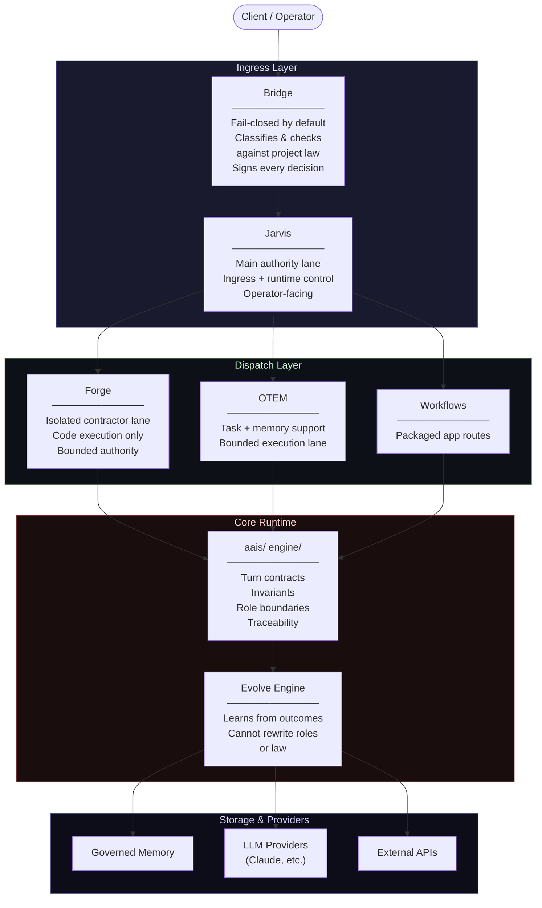

If you want to understand how my mind works, check out my writing. I’ve published 26 books under two names — my own, Jon Halstead, and my pen name, Adam Wolfe. Jon Halstead is my worldbuilding and systems side. Adam Wolfe is the darker, human edge of those systems. I’m not only an architect — I’m a writer, too.


# AAIS — Adaptive Assistant Intelligence System

> **Behavior enforced, not implied.**

AAIS is a local-first, law-governed assistant runtime. Every request, every decision, every reroute is explicit, visible, and accountable.

Built for environments where **behavior matters more than output**.

---

## Why AAIS Exists

Most assistant systems optimize for answers. AAIS optimizes for behavior.

- One clear operating contract per turn
- No silent reroutes or hidden fallbacks
- Risky and experimental work isolated from normal work
- Operator control preserved, not abstracted away
- Every decision leaves a signed, time-bound trace

**Core doctrine: Stabilize and Free.**
Stability before freedom. The system earns more responsibility by staying inside clear rules, explaining its behavior, and failing in a controlled way. If it cannot do that, it slows down, asks for confirmation, or stops.

---

## Architecture

Every request moves through a fixed, law-bound path. Nothing bypasses the chain.



### Layer Roles

| Layer | Component | Role |
|-------|-----------|------|
| **Ingress** | Bridge | Front door and primary safety boundary. Fail-closed. Signs every decision. |
| **Ingress** | Jarvis | Main authority lane. Operator-facing ingress and runtime control. |
| **Dispatch** | Forge | Isolated contractor lane. Code execution only. Bounded authority. |
| **Dispatch** | OTEM | Bounded task and memory support. |
| **Dispatch** | Workflows | Packaged app route layer. |
| **Core** | Runtime | Enforces turn contracts, invariants, role boundaries, continuity, traceability. |
| **Core** | Evolve Engine | Learns from outcomes within bounds. Cannot alter role definitions or law. |

---

## Quick Start

```bash
pip install -e .
python -m aais start --data-dir ./.runtime/aais-data
```

| Surface | URL |
|---------|-----|
| App | http://127.0.0.1:8000/app |
| Jarvis Console | http://127.0.0.1:8000/app/jarvis |
| Health | http://127.0.0.1:8000/health |

**Optional preflight:**

```bash
python -m aais prepare --force-build --data-dir ./.runtime/aais-data
python -m aais doctor --data-dir ./.runtime/aais-data
```

**Frontend dev server:**

```bash
cd frontend
npm install && npm run dev
```

Surfaces: `localhost:3000/jarvis` · `localhost:3000/workbench` · `localhost:3000/memory`

---

## Requirements

Use `requirements.txt` for standard local setup.

| File | Purpose |
|------|---------|
| `requirements.txt` | Standard local |
| `requirements-local.txt` | Local dev extras |
| `requirements-laptop.txt` | Constrained/laptop env |
| `requirements-advanced.txt` | Full feature set |
| `requirements-training.txt` | Training pipeline only |

---

## Optional: Claude Provider

```bash
export ANTHROPIC_API_KEY=your_key
export AAIS_CLAUDE_MODEL=claude-sonnet-4-20250514
export AAIS_ENABLE_CLAUDE_AUTO_ROUTING=true
```

Or pin Claude via `provider_mode=claude_first` in the Jarvis Console.

---

## Repository Structure

```
aais/                  Core runtime
api/                   API surface
app/                   Packaged shell + workflows
src/                   Entry points (jarvis_operator.py, api.py)
docs/
  spine/               Canonical reading path
  runtime/             System references
  contracts/           Laws + doctrine
  subsystems/          Admitted subsystem packs
  audit/               Coverage + status
  _archive/            Lineage — not authoritative
  _future/             Planned — not live
engine/                Foundation layer
forge/                 Bounded contractor lane
evolve_engine/         Outcome-based adaptation
evals/                 Evaluation harness
tests/                 Full test suite
frontend/              Web app
mobile/                Expo mobile app
training/              Training pipeline
```

Only `docs/` (excluding `_archive/` and `_future/`) is authoritative for runtime understanding.

---

## Documentation

| Document | Governs |
|----------|---------|
| [AAIS Human Guide](docs/spine/) | System overview |
| [AAIS AI Operating Contract](docs/contracts/) | Runtime behavior contract |
| [AAIS Master Spec](docs/spine/) | Full specification |
| [REPO_LAWBOOK.md](REPO_LAWBOOK.md) | Full repo operating law |

**Project Laws:**

| Document | Governs |
|----------|---------|
| README Law v1 | Documentation rules |
| External Suggestion Admission Rule | How external input enters the system |
| ARIS Runtime Contract | Embedded repo-intelligence law |
| Cognitive Bridge Runtime Law | Ingress + attestation rules |

---

## Cognitive Architecture

[Unified Architectural Hyper-Systemizer](https://zenodo.org/records/20067067) — Formal specification of the cognitive engine behind Project Infinity (May 5, 2026).

---

## Points of Interest

AAIS contains deeper layers for those who explore:

- **Internal architecture layers** — nested subsystems, lineage, early doctrine
- **Foundation artifacts** — structural invariants, long-term stability markers in `engine/`
- **Historical documents** — `docs/_archive/` shows the system's evolution
- **Introspective traces** — certain components maintain narrative metadata as subsystems are added

These are optional and not required for running the system.

---

## Security

See [SECURITY.md](SECURITY.md) for the disclosure policy.

## License

Apache 2.0
