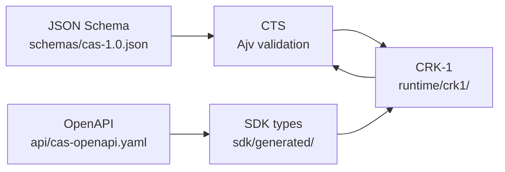

# AAES-OS

**A constitutional operating system for governed AI.**

AAES-OS enforces invariants before and after every run, emits verifiable receipts, and keeps runtime behavior **deterministic, inspectable, and accountable**. It is built around **CAS 1.0** (Constitutional Agent Specification) and the **CRK-1** reference runtime.

> Full v1.0 launch docs (papers, governance handbook, tutorials):  
> [Project-Infinity1 `docs/aaes-os/`](https://github.com/warheart1984-ctrl/Project-Infinity1/tree/codex/aaes-os-production-sweep/docs/aaes-os)

---

## What you get

| Component | Path | Role |
|-----------|------|------|
| **CAS 1.0** | `schemas/cas-1.0.json`, `api/cas-openapi.yaml` | Canonical objects + HTTP API contract |
| **CRK-1 runtime** | `runtime/crk1/` | Reference governed execution loop |
| **CTS** | `tests/cts/` | Conformance tests (objects, lifecycle, governance, schema) |
| **SDK** | `sdk/` | Local + HTTP client; types generated from OpenAPI |
| **CDP-1** | `benchmarks/cdp1/` | Minimal continuity / drift experiment |
| **CEP** | `cep/` | Experiment orchestration scaffold |
| **Replication** | `replication/` | Independent replication package |
| **Architect-agent loop** | `packages/architect-agent/` | UGR-to-UCR contracts, ALA runtimes, reversible envelopes, EGL-1, receipts |

---

## Architecture (closed loop)



- **CAS objects** are defined in JSON Schema and validated in CTS.
- **HTTP API** is defined in OpenAPI; SDK types are generated (`pnpm sdk:generate`).
- **CRK-1** implements the spec and is checked by CTS on every change.

---

## Quick start

**Prerequisites:** Node.js ≥ 20, [pnpm](https://pnpm.io/) ≥ 9

```bash
git clone https://github.com/warheart1984-ctrl/AAES-OS.git
cd AAES-OS
pnpm install
```

### Run conformance tests

```bash
pnpm test:cts
```

### Use the SDK (local, in-process)

```typescript
import { createLocalSdk } from './sdk/index.js';

const sdk = createLocalSdk();
const result = await sdk.run.execute({
  identity: sdk.identity.fromEnv(),
  payload: { prompt: 'Hello' },
});
```

### Use the SDK (remote HTTP)

```typescript
import { createCasClient } from './sdk/index.js';

const client = createCasClient({ baseUrl: 'http://localhost:8787' });
const { data } = await client.POST('/run', {
  body: {
    identity: { id: 'agent-1', type: 'agent' },
    payload: { prompt: 'Hello' },
  },
});
```

Regenerate OpenAPI types after spec changes:

```bash
pnpm sdk:generate
```

### Optional: SkillzMcGee lawful Nova slice

AAES-OS can be run independently with CTS and CRK-1. If you want an operator
surface backed by the SkillzMcGee governed LLM slice, use SkillzMcGee as a
neighboring runtime and configure its `llm_echo` capability for deterministic,
Ollama, or Nova/OpenAI-compatible provider mode.

See [docs/integrations/skillzmcgee-lawful-nova.md](docs/integrations/skillzmcgee-lawful-nova.md).

### Run CDP-1 minimal benchmark

```bash
pnpm cdp1
```

---

## Repository layout

```
runtime/crk1/          # CRK-1 reference runtime (CAS 1.0)
sdk/                   # Developer SDK (local + HTTP)
  generated/           # OpenAPI-derived types (do not edit by hand)
  scripts/             # sdk:generate
api/                   # CAS 1.0 OpenAPI spec
schemas/               # CAS 1.0 JSON Schema
tests/cts/             # Conformance test suite
benchmarks/cdp1/       # CDP-1 harness
cep/                   # Continuity experiment platform
packages/              # UCR spine workspace packages
services/ops-console/  # Telemetry UI + Prometheus metrics
replication/           # Independent replication guide
```

---

## Development

```bash
pnpm build            # workspace packages
pnpm test             # build + vitest (unit + integration)
pnpm test:cts         # CAS 1.0 conformance only
pnpm test:determinism # deterministic replay validator
```

| Doc | Link |
|-----|------|
| Roadmap | [ROADMAP.md](ROADMAP.md) |
| Contributing | [CONTRIBUTING.md](CONTRIBUTING.md) |
| Changelog | [CHANGELOG.md](CHANGELOG.md) |
| Release dashboard | [RELEASE_DASHBOARD.md](RELEASE_DASHBOARD.md) |
| Evidence ledger | [EVIDENCE_LEDGER.md](EVIDENCE_LEDGER.md) |
| CTS README | [tests/cts/README.md](tests/cts/README.md) |

---

## Ops console (optional)

```bash
pnpm --filter @aaes-os/ops-console dev
```

- UI: http://localhost:5173  
- API / metrics: http://localhost:4000 (`/telemetry`, `/metrics`)

---

## License

Apache 2.0. See the [Project-Infinity1](https://github.com/warheart1984-ctrl/Project-Infinity1) repository for the canonical `LICENSE` when this tree is consumed as part of the monorepo.

---

## Contribute

AAES-OS is designed to be **challenged**. Open an issue, run CTS, attach receipts. See [CONTRIBUTING.md](CONTRIBUTING.md).
