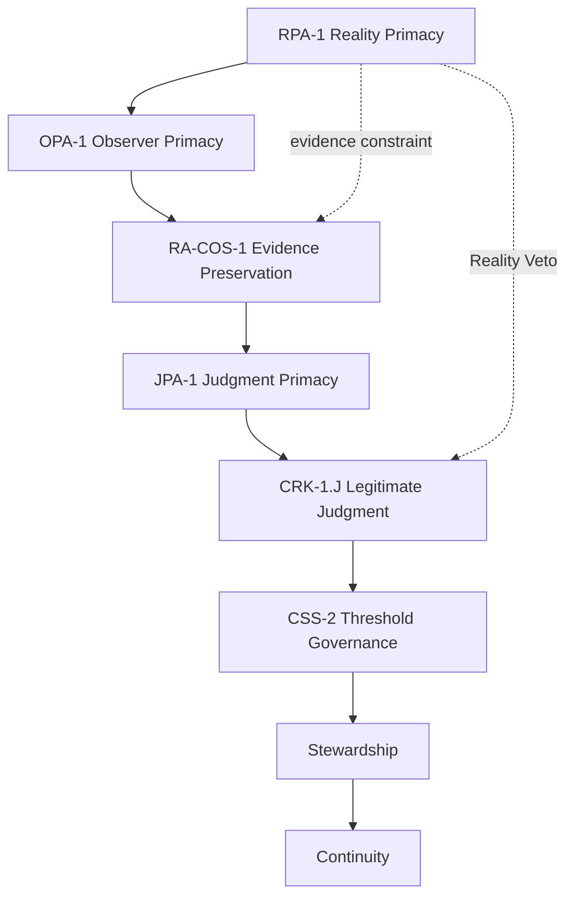

# Constitutional Stack — RPA-1 at the Top

Unified constitutional stack for continuity-engine v1.0.

## RPA-1 — Reality Primacy Amendment

### RPA-1.1 — Reality as Ultimate Authority

Reality is the final arbiter of judgment.  
No doctrine, hierarchy, incentive structure, or internal metric may claim higher authority than reality as expressed through evidence.

### RPA-1.2 — Evidence as Reality's Interface

Evidence is the constitutionally protected channel through which reality constrains judgment.  
Any obstruction, fabrication, or suppression of evidence is a constitutional violation.

### RPA-1.3 — Judgment Under Reality

Judgment is legitimate only when it remains answerable to evidence.  
A judgment act that cannot be corrected by evidence is constitutionally illegitimate, regardless of procedure.

### RPA-1.4 — Stewardship as Transmission of Reality's Authority

Stewardship is the preservation of reality's authority over judgment across lineage.  
Future stewards must inherit not conclusions, but the structural ability for reality to correct their conclusions.

### RPA-1.5 — Continuity

Continuity is the preserved relationship in which:

- reality generates evidence,
- evidence constrains judgment,
- judgment produces action,
- outcomes generate new evidence,
- and stewards maintain this loop across generations.

Continuity fails when reality loses the ability to correct judgment, even if cycles continue to run.

## Stack Ordering (top-down)

```
RPA-1        Reality Primacy
OPA-1        Observer Primacy
RA-COS-1     Evidence Preservation
JPA-1        Judgment Primacy (reality-correctable cycles)
CRK-1.J      Legitimate Judgment
CRK-1.K0–K3  Consequence Transmission (Decision→Outcome→Evidence)
CSS-2        Threshold & Δ-Threshold Governance
Stewardship  Lineage of authority under reality
Continuity   Emergent property of the whole stack
```

## Causal Flow

See [Reality → Evidence → Judgment → Stewardship → Continuity](./REALITY-EVIDENCE-JUDGMENT-STACK.md).

## Failure Taxonomy

See [Constitutional Failure Modes](./CONSTITUTIONAL-FAILURE-MODES.md) (F-1, F-2, F-3).

## Mermaid



## The 1000-Year Move

> Do not try to predict the future. Encode a structure where reality always wins.

## Related Whitepapers

- [RPA-1 Reality Primacy](./RPA-1-WHITEPAPER.md)
- [Constitutional Failure Modes](./CONSTITUTIONAL-FAILURE-MODES.md)
- [Reality → Continuity Stack](./REALITY-EVIDENCE-JUDGMENT-STACK.md)
- [CSS-2 + JPA-1](./CSS-2-WHITEPAPER-JPA-1.md)
- [CRK-1 Legitimate Judgment](./CRK-1-WHITEPAPER-LEGITIMATE-JUDGMENT.md)
- [CRK-1 Consequence Kernel (K0–K3)](./CRK-1-WHITEPAPER-CONSEQUENCE-KERNEL.md)
- [JPSS-2 Judgment Curriculum](./JPSS-2-WHITEPAPER-JUDGMENT-CURRICULUM.md)
- [RA-COS-1 Judgment Drift](./RA-COS-1-WHITEPAPER-JUDGMENT-DRIFT.md)
- [Sound Judgment Cycle](./SOUND-JUDGMENT-CYCLE.md)
