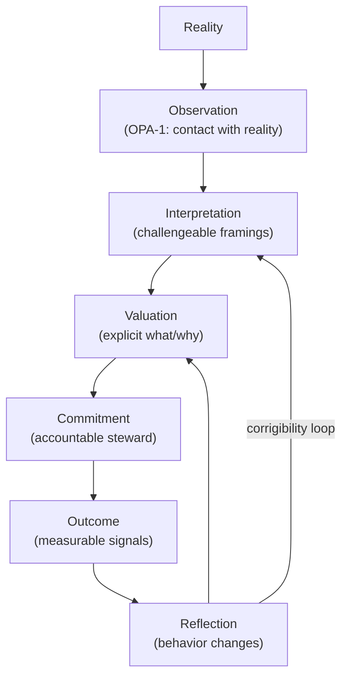

# Sound Judgment Cycle

Diagram for talks, slides, and constitutional onboarding.

## Text Diagram

```
Reality
  ↓
[Observation]
  |  (OPA-1: contact with reality)
  ↓
[Interpretation]
  |  (challengeable framings)
  ↓
[Valuation]
  |  (explicit what/why)
  ↓
[Commitment]
  |  (accountable steward)
  ↓
[Outcome]
  |  (measurable signals)
  ↓
[Reflection]
  |  (behavior changes)
  ↺─────────────── back to Interpretation / Valuation
        (corrigibility loop)
```

**Sound Judgment Cycle** = completed process + open channel for reality to change future behavior.

## Mermaid



## Failure Hierarchy

| Failure mode | Description |
|--------------|-------------|
| **Observer Failure** | Can't see reality |
| **Judgment Failure** | Can't reason about what matters |
| **Correction Failure** | Can't be changed by reality |

## Deepest Invariant

> Preserve reality-correctable judgment through lineage.

Future stewards don't need our answers.  
They need our cycles, our evidence, and an architecture that refuses to let reality stop mattering.

## Runtime

- `JudgmentCycle` — `judgment/cycle.ts`
- `assessCorrigibility()` — CRK-1.J.5 Corrigibility Test
- `JudgmentCycleLedger` — `judgment/cycle-ledger.ts`
