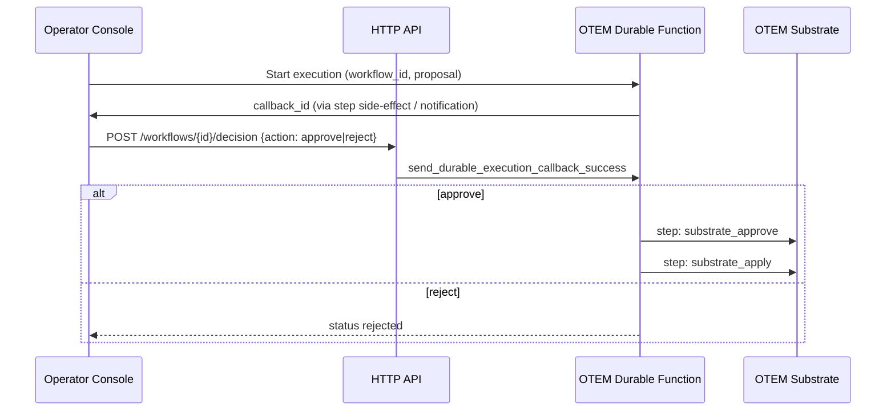

# AWS Serverless — OTEM Governance Spike

SAM scaffold for **governed OTEM execution** on AWS, mapped from the existing Temporal
workflow in `src/otem_temporal/workflows.py`. Produced using the **AWS Serverless**
Cursor plugin (`aws-lambda-durable-functions`, `api-gateway`, `aws-serverless-deployment`
skills).

## Why this fits project-infi

| Existing piece | AWS Serverless mapping |
|---|---|
| `OTEMExecutionTemporalWorkflow` — wait for operator signal | Lambda **durable function** `wait_for_callback` (no compute charge while waiting) |
| `operator_decision` signal (`approve` / `reject`) | HTTP API `POST /workflows/{workflowId}/decision` → `send_durable_execution_callback_success` |
| `otem_substrate_approve` / `otem_substrate_apply` activities | Named durable **steps** with retry (mirrors Temporal activity retry policy) |
| `src/operator_api_routes.py` Flask seam | HTTP API + optional JWT authorizer (WorkOS / Cognito — wire at deploy time) |
| `docs/audit/COMPONENT_AUDIT.md` Lambda + API Gateway line | First concrete IaC artifact under `deploy/` |

Temporal remains valid for local/dev and multi-language workers. This spike is the
**AWS-native alternative** when you want operator approvals without running a Temporal
cluster — same constitutional flow, different orchestrator.

## Layout

```
deploy/aws-serverless/
├── README.md
├── template.yaml
└── src/
    ├── otem_durable_handler.py      # Durable orchestration (approve → apply)
    └── operator_decision_api.py     # API Gateway → callback completion
```

## Prerequisites

| Check | Notes |
|---|---|
| AWS SAM CLI | `sam --version` |
| AWS credentials | `aws sts get-caller-identity` |
| Python 3.13+ runtime | Durable Execution SDK pre-installed on 3.13+ Lambda runtimes |
| `aws-serverless-mcp` MCP | Enable in Cursor plugin settings for live SAM init/deploy guidance |

## Validate (no AWS deploy required)

```powershell
cd e:\project-infi\deploy\aws-serverless
sam validate --lint
```

## Deploy (when credentials are ready)

```powershell
sam build
sam deploy --guided
```

Stack outputs:

- `OtemWorkflowApiUrl` — base URL for operator decisions
- `OtemDurableFunctionAliasArn` — qualified ARN for async OTEM starts

## Operator flow (mirrors Temporal)



## Wiring to canonical Python substrate

The durable handler calls the same substrate entry points as Temporal activities
(`src/otem_temporal/activities.py`):

- `get_otem_execution_substrate().approve(workflow_id, runtime_context="operator_runtime")`
- `get_otem_execution_substrate().apply(...)`

For Lambda, package `src/` into the deployment artifact or invoke the AAIS API over
private API Gateway / VPC link once the Flask app runs on ECS.

## Next steps

1. Add JWT authorizer on `OperatorDecisionApi` (WorkOS issuer — matches `require_workos_operator_permission`).
2. Emit `operator_decision_ledger` events from `operator_decision_api.py` on each callback.
3. Compare cost/latency vs Temporal on pilot traffic before promoting to production lane.
