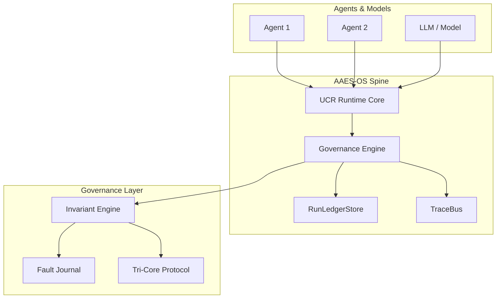
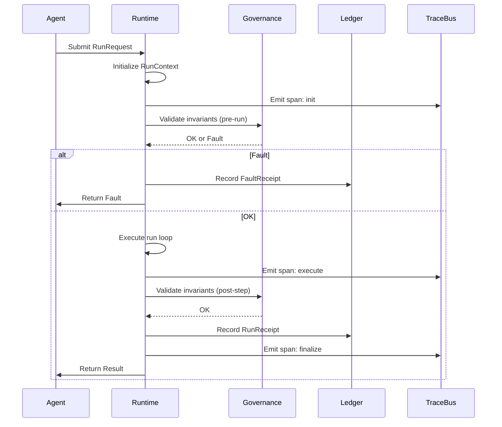
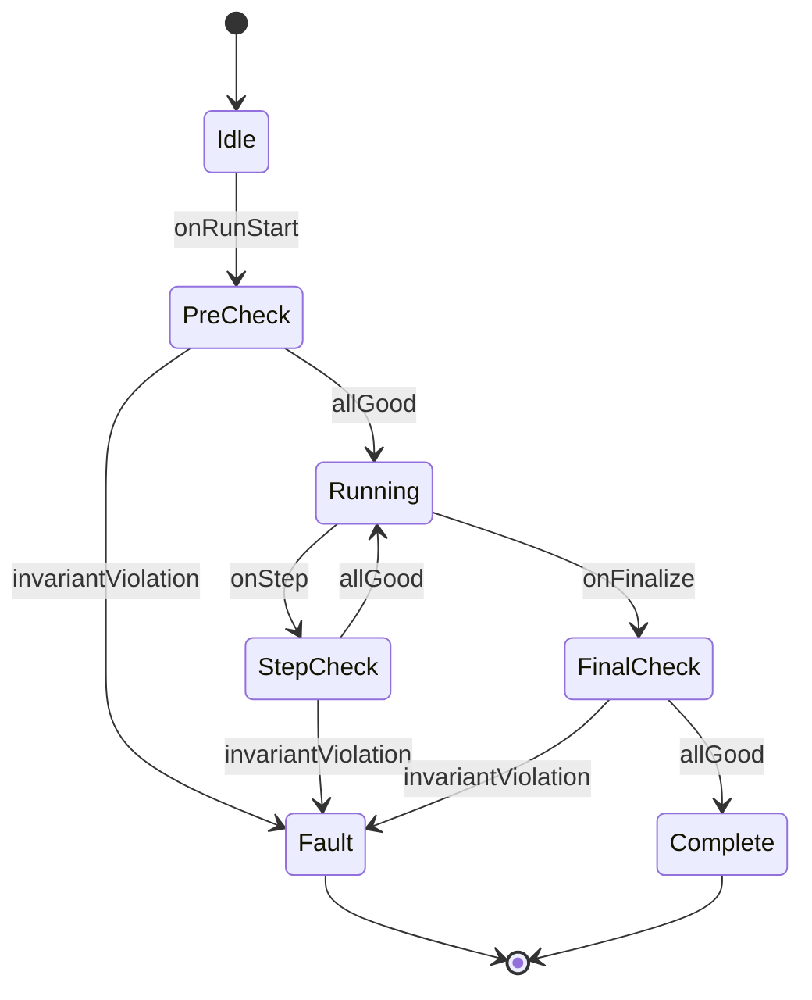

# AAES-OS Architecture Diagrams

## System overview

```mermaid
flowchart TD

    subgraph Agents & Models
        A1[Agent 1]
        A2[Agent 2]
        A3[LLM / Model]
    end

    subgraph AAES-OS Spine
        R1[UCR Runtime Core]
        G1[Governance Engine]
        L1[RunLedgerStore]
        T1[TraceBus]
    end

    subgraph Governance Layer
        I1[Invariant Engine]
        F1[Fault Journal]
        P1[Tri-Core Protocol]
    end

    A1 --> R1
    A2 --> R1
    A3 --> R1

    R1 --> G1
    G1 --> L1
    G1 --> T1

    G1 --> I1
    I1 --> F1
    I1 --> P1
```

## Runtime lifecycle

```mermaid
sequenceDiagram
    participant Agent
    participant Runtime
    participant Governance
    participant Ledger
    participant TraceBus

    Agent->>Runtime: Submit RunRequest
    Runtime->>Runtime: Initialize RunContext
    Runtime->>TraceBus: Emit span: init
    Runtime->>Governance: Validate invariants (pre-run)

    Governance-->>Runtime: OK or Fault
    alt Fault
        Runtime->>Ledger: Record FaultReceipt
        Runtime->>Agent: Return Fault
    else OK
        Runtime->>Runtime: Execute run loop
        Runtime->>TraceBus: Emit span: execute
        Runtime->>Governance: Validate invariants (post-step)
        Governance-->>Runtime: OK
        Runtime->>Ledger: Record RunReceipt
        Runtime->>TraceBus: Emit span: finalize
        Runtime->>Agent: Return Result
    end
```

## Invariant engine state machine

```mermaid
stateDiagram-v2
    [*] --> Idle

    Idle --> PreCheck: onRunStart
    PreCheck --> Fault: invariantViolation
    PreCheck --> Running: allGood

    Running --> StepCheck: onStep
    StepCheck --> Fault: invariantViolation
    StepCheck --> Running: allGood

    Running --> FinalCheck: onFinalize
    FinalCheck --> Fault: invariantViolation
    FinalCheck --> Complete: allGood

    Fault --> [*]
    Complete --> [*]
```
