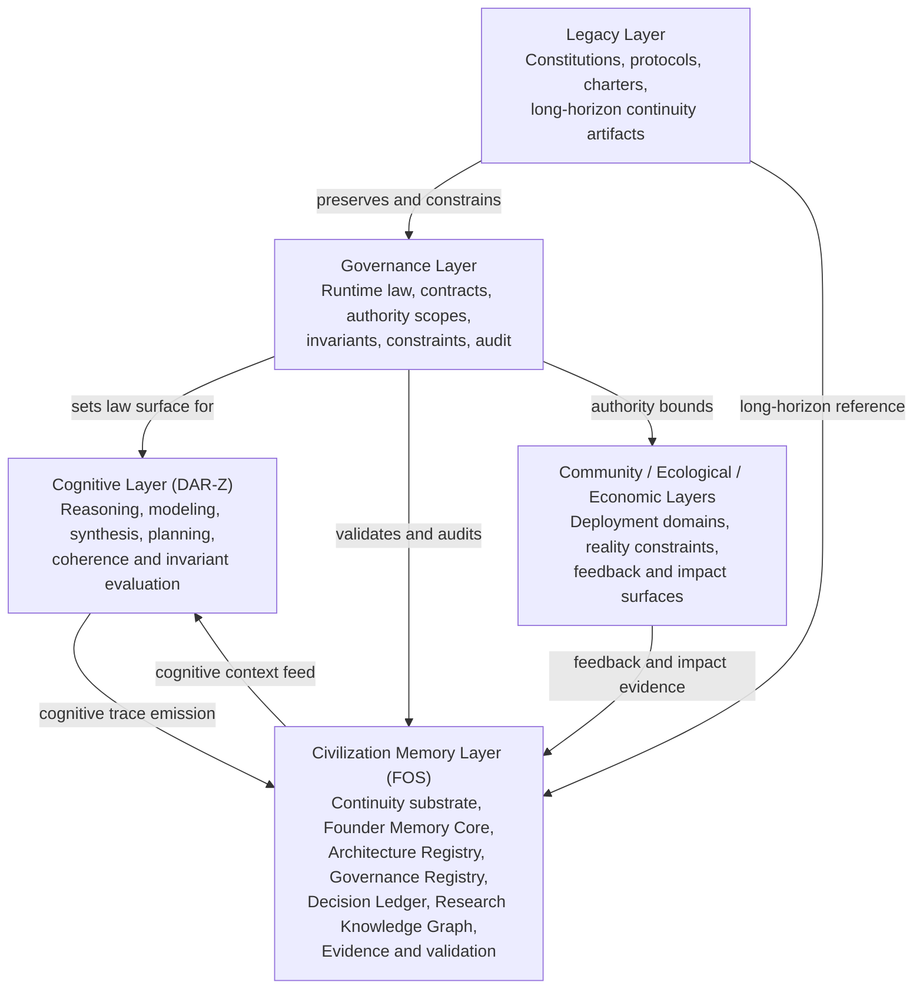

# Unified Civilization Stack v1.0

Status: canonical architecture map

This document defines the top-level civilization stack that binds FOS
(Civilization Memory), DAR-Z (Cognitive Layer), governance, deployment reality,
and legacy preservation into one continuity-bearing system.

The stack is an architecture and charter. It does not grant autonomous authority
to any component. DAR-Z reasons and proposes; governed systems decide and record.

## Stack Diagram



## Layer Charter

### Civilization Memory Layer (FOS)

FOS is the governed world model and continuity substrate.

Responsibilities:

- Maintain Founder Memory Core.
- Maintain Architecture Registry.
- Maintain Governance Registry.
- Maintain Decision Ledger.
- Maintain Research Knowledge Graph.
- Store evidence and validation artifacts.
- Expose governed, evidence-bound context to cognitive systems.
- Preserve continuity threads across versions and epochs.

### Cognitive Layer (DAR-Z)

DAR-Z is the systems intelligence layer.

Responsibilities:

- Reason, model, synthesize, and plan.
- Evaluate coherence and invariants.
- Produce evidence-bearing decision proposals.
- Emit reasoning traces with parent pointers.
- Disclose assumptions, memory use, invariant checks, and violations.

Boundary:

- DAR-Z does not execute actions.
- DAR-Z proposes; governed execution systems decide through authority scopes and
  receipts.

### Governance Layer

The Governance Layer defines runtime law.

Responsibilities:

- Define contracts, authority scopes, invariants, and constraints.
- Validate decision proposals.
- Audit traces, receipts, and evidence.
- Instrument runtime systems.
- Surface violations and missing evidence.

### Community / Ecological / Economic Layers

These layers connect architecture to reality.

Responsibilities:

- Represent deployment domains.
- Capture social, ecological, and economic constraints.
- Provide feedback and impact evidence.
- Prevent abstract governance from ignoring real-world effects.

### Legacy Layer

The Legacy Layer preserves long-horizon artifacts.

Responsibilities:

- Preserve constitutions, protocols, charters, foundational architectures, and
  pivotal decisions.
- Maintain historical versions.
- Provide read-only constitutional reference to FOS, DAR-Z, governance systems,
  and community-facing transparency surfaces.

## FOS to DAR-Z Interface Contract

### FOS to DAR-Z: Cognitive Context Feed

```json
{
  "continuity_thread_id": "thread-uuid",
  "memory_refs": ["mem:concept-123", "mem:arch-456", "mem:gov-789"],
  "schemas": ["schema:ontology-v1", "schema:invariants-v1"],
  "evidence_refs": ["evid:doc-001", "evid:telemetry-2026-06-19"]
}
```

DAR-Z obligations:

- Use only referenced memory as context.
- Disclose which memory objects were used.
- Bind reasoning trace to `continuity_thread_id`.
- Flag missing evidence, missing memory, or schema mismatch.

### DAR-Z to FOS: Cognitive Trace Emission

```json
{
  "darz_continuity_thread_id": "thread-uuid",
  "reasoning_trace": [],
  "derived_concepts": ["mem:new-concept-001"],
  "proposed_decisions": [],
  "assumptions": [],
  "invariants_checked": [],
  "violations": [],
  "evidence_refs": []
}
```

FOS obligations:

- Store trace as continuity events.
- Register derived concepts in Memory Core.
- Link decisions into Decision Ledger.
- Update Architecture Registry and Governance Registry when appropriate.
- Preserve evidence links and version lineage.

## Governed Civilization Memory Specification

Civilization Memory is a governed world model, not a document store.

Each memory object must include:

- `id`
- `type`
- `definition`
- `evidence_refs`
- `lineage`
- `version`
- `continuity_thread`

Valid memory object types:

- `concept`
- `pattern`
- `architecture`
- `governance_contract`
- `decision`
- `evidence`
- `continuity_thread`
- `legacy_artifact`

Memory invariants:

- No object without evidence.
- No object without lineage.
- No object without version.
- No object without type and definition.
- All changes are continuity-anchored and versioned.

World model properties:

- Queryable by DAR-Z and other governed systems.
- Governed by invariants and validation rules.
- Continuity-bearing across epochs.
- Replayable through evidence and lineage.

## DAR-Z Constitutional Envelope

DAR-Z operates under these articles:

1. Non-Execution: DAR-Z never executes actions; it only reasons and proposes.
2. Evidence Binding: Every claim and proposal must cite evidence.
3. Continuity Anchoring: Every run binds to a governance continuity thread.
4. Invariant Disclosure: All invariants checked and violated must be surfaced.
5. Lineage Production: Full reasoning trace with parent pointers is mandatory.
6. Coherence Priority: Promotion to higher tiers requires coherence; coherence
   dominates stability.
7. No Silent Failure: Missing evidence, violated invariants, or incomplete
   reasoning must be explicitly flagged.

This envelope is the constitutional law under which DAR-Z operates inside the
stack.

## Legacy Layer Preservation Protocol

Purpose:

Preserve constitutions, protocols, decisions, and long-horizon artifacts beyond
any single epoch or project.

Protocol:

1. Selection

   Identify artifacts as legacy-bearing when they are constitutions, charters,
   core governance contracts, foundational architectures, or pivotal decisions.

2. Canonicalization

   Normalize legacy artifacts into one of:

   - `LegacyConstitution`
   - `LegacyProtocol`
   - `LegacyDecision`
   - `LegacyBlueprint`

3. Binding

   Attach:

   - `continuity_thread_id`
   - `evidence_refs`
   - `governance_contract_refs`
   - `version`
   - `epoch`

4. Preservation

   Store in a dedicated Legacy Registry within FOS. Enforce immutability except
   through explicit amendment processes.

5. Access

   Expose read-only interfaces to:

   - FOS
   - DAR-Z
   - Governance Layer
   - community-facing transparency systems

6. Amendment

   Any change to a legacy artifact must be versioned, continuity-anchored, pass
   governance review, and preserve prior versions as historical record.

## Unified Continuity Rule

The stack is valid only when memory, reasoning, governance, reality feedback,
and legacy preservation remain linked through continuity threads, evidence, and
versioned lineage.

In compact form:

```text
Civilization continuity =
  governed memory
  + bounded cognition
  + runtime law
  + reality feedback
  + legacy preservation
  + evidence-linked lineage
```

