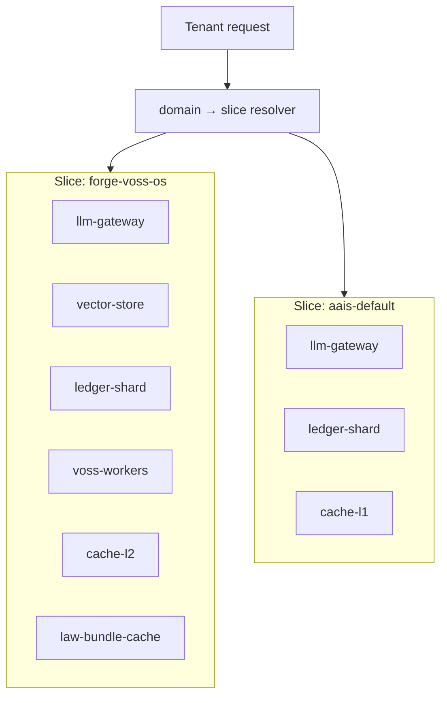

# Cloud Forge Domain Slice Layout (Phase 4)

Status: **active** (spec + registry; deployment is operator-driven).

Authority: `docs/cloud-forge-governed-accelerator-program.md`, `configs/cloud-forge/domain-slices.json`.

Related: Wolf-cog P8 `docs/forge-cloud-output-contract.md` (OS image outputs — separate from AAIS cognitive Cloud Forge).

## Purpose

Co-locate governed cognitive components per **domain** so high-weight tenants hit the same region, law bundle, cache shard, and ledger partition.

## Topology (logical)

## Slice registry

Machine-readable: `configs/cloud-forge/domain-slices.json`.

| slice_id | domain | namespace | region |
|---|---|---|---|
| `forge-voss-os` | `forge/voss/os_architecture` | `cloud-forge-forge-voss` | `us-central1` |
| `aais-default` | `*` (fallback) | `cloud-forge-default` | `us-central1` |

## Co-location rules

1. **Same slice** — LLM gateway, vector index, ledger shard, Voss workers, and L2 cache for a domain share namespace + region.
2. **Law bundle** — `law-bundle-cache` holds pre-resolved `law_id` + `law_version` artifacts for the slice (see session prewarm).
3. **No cross-tenant ledger** — shard key includes `tenant_id`; slice only shares infrastructure.
4. **Wolf-cog Forge ISO** — remains on OS factory pipeline; do not merge with cognitive slice namespaces.

## Kubernetes mapping (reference)

| Runtime concern | K8s object |
|---|---|
| Slice isolation | `Namespace` per `slice_id` |
| Weight → scheduling | `PriorityClass` from `map_governance_to_priority()` |
| Session prewarm | `ConfigMap` or in-memory gateway cache keyed by `session_id` |
| Background tempering | `CronJob` `cloud-forge-tempering` (see tempering job doc) |

## Resolver API

Implementation: `src/cloud_forge/locality.py` → `resolve_domain_slice(domain)`.

## Change-of-reality

Update this doc and `domain-slices.json` together when adding domains or regions.
