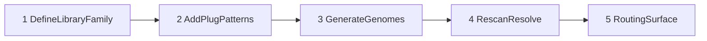

# AAIS Library Admission Protocol

Status: **active contract**

CISIV stage: **structure**

## Purpose

Normative five-step process for admitting **libraries** — capability families, not code — into
AAIS. A library groups plugs, genomes, workflow bundles, and routing entries under one governed
family identity.

Related contracts:

- [`PLUGIN_GOVERNANCE_CONTRACT.md`](PLUGIN_GOVERNANCE_CONTRACT.md)
- [`AAIS_WORKFLOW_ABILITY_CATALOG.md`](../runtime/AAIS_WORKFLOW_ABILITY_CATALOG.md)
- [`AAIS_AGENT_WORKFLOW_CAPABILITY_MAP.md`](../runtime/AAIS_AGENT_WORKFLOW_CAPABILITY_MAP.md)
- Schema: [`aais_library.v1.json`](../../schemas/aais_library.v1.json)
- Registry: [`aais_library_registry.v1.json`](../../governance/aais_library_registry.v1.json)

## Library classes

| Class | Mount | Adapter |
|-------|-------|---------|
| `mcp` | `mcp_server_manifest.v1.json` + MCP bridge | `src.mcp_bridge` |
| `cursor_skill` | Cursor skills cache `SKILL.md` | `src.skill_adapter` |
| `hf_agent_skill` | HF plugin cache `SKILL.md` | `src.skill_adapter` |
| `native_capability` | Capability service bridge routes | `src.native_capability_adapter` |
| `workflow` | `workflow_plugin_bundles.v1.json` | `src.workflow_plugin_catalog` |

## Five-step admission pipeline



### Step 1 — Define library family

Add an entry to `governance/aais_library_registry.v1.json` with:

- `identity.library_id` — `lib_<family>` prefix
- `identity.library_class` — one of the four classes above (plus `hf_agent_skill`)
- `family` — category, capability summary, authority ladder
- `mount.plug_patterns[]` — glob patterns matching member plugs
- `mount.genome_gene` — target subsystem genome gene
- `governance` — receipts, replay, operator approval, CISIV path
- `routing` — capability map lane and workflow catalog category

### Step 2 — Add plug patterns

For **workflow** libraries, append a bundle to `governance/workflow_plugin_bundles.v1.json`
with `workflow_id`, `steps[]`, and `required_gates[]`. Steps without a live plug use
`status: "pending_plug"` so readiness reports honestly.

For **MCP / skill / native** libraries, ensure discovery emits plugs matching
`mount.plug_patterns[]`.

### Step 3 — Generate genomes

```bash
make generate-plugin-genomes
python tools/governance/generate_plugin_genome.py --write
```

`generate_plugin_genome.py` reads the library registry and emits per-library genomes.
Parent genomes (`plug_adapter_runtime`, `mcp_bridge`, `capability_service_bridge`) receive
symmetric `lineage.children[]` patches.

### Step 4 — Rescan and resolve

```bash
make plug-adapter-gate
curl -X POST /api/operator/plugins/rescan
```

`build_library_catalog()` groups live plugs by `library_id` and computes readiness
(`ready` / `partial` / `missing`).

### Step 5 — Routing surface

Admission appends rows to:

- `AAIS_AGENT_WORKFLOW_CAPABILITY_MAP.md` — `## Library Routing Registry`
- `AAIS_WORKFLOW_ABILITY_CATALOG.md` — `## Library Families`

Use the admission CLI to automate steps 3–5:

```bash
make admit-library LIB=lib_workflow_data_visualization
python tools/governance/admit_library.py --library-id lib_hf_model_trainer --write
```

## Gate

```bash
make library-gate
```

Validates:

1. Registry entries conform to `aais_library.v1.json`
2. Workflow bundle IDs match workflow library `workflow_bundle_id`
3. All `mount.genome_gene` files exist under `governance/subsystem_genomes/`
4. Parent lineage symmetry for plug adapter parents

## Non-goals

- Auto-executing HF skill bodies (assist/catalog only)
- Workflow DAG execution engine (v1 remains catalog + per-step invoke)
- Inventing plugs for calendar/CRM/spreadsheet — use `pending_plug` instead
