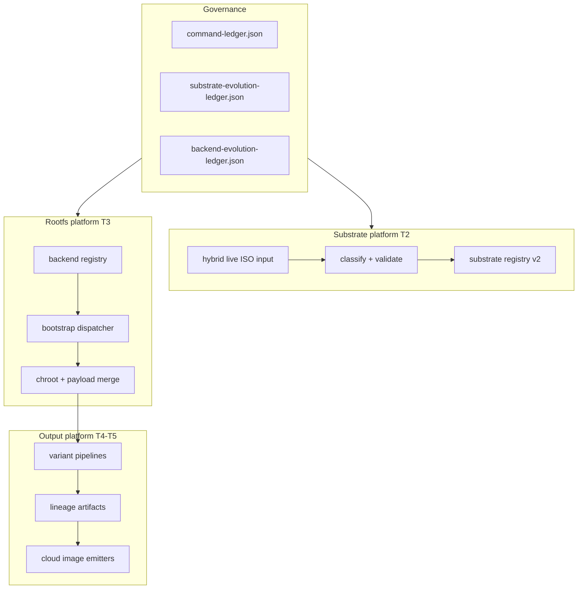

# Forge Platform Program — Multi-Distro OS Evolution Engine

Status: canonical platform roadmap (Meta Architect tier).

Authority: `META_ARCHITECT_LAWBOOK.md`, `docs/forge-build-program.md`, `docs/forge-substrate-contract.md`.

## Vision

Forge evolves from a **Debian-centric ISO factory** into a **meta-OS platform**:

| Tier | Capability | Value band (strategic) |
|---|---|---|
| T1 | OS-agnostic substrate replay | Foundation (done P4) |
| T2 | Auto substrate classification + multi-distro classes + contract versioning | $300M–$500M path |
| T3 | Rootfs backend abstraction (debootstrap, pacstrap, dnfroot, apkroot) | Universal construction |
| T4 | Variant pipelines, lineage, nightly evolution, reproducibility | Enterprise factory |
| T5 | Multi-arch + cloud image output + governance at scale | Platform tier ($500M+) |

This program sequences T2–T5 without breaking the existing CoGOS/Wolf pipeline.

## Architecture layers



## Phase map

| Phase | Scope | Status |
|---|---|---|
| P0–P4 | Profile contract, Forge ISO, shippable gate | COMPLETE |
| **P5** | Substrate platform v2: classification, multi-distro classes, contract versioning, evolution ledger | **COMPLETE** |
| **P6** | Rootfs backend abstraction: registry, dispatcher, debootstrap production + stubs | **COMPLETE** |
| **P7** | Variant pipelines + reproducible lineage artifacts | **COMPLETE** |
| **P8** | Multi-arch matrix + cloud image output contracts | **COMPLETE (stubs)** |
| **P9** | Platform gate + nightly evolution loop | **COMPLETE (Gate G APPROVED 2026-05-28)** |
| **P10** | Non-Debian replay adapters (ubuntu + experimental wired) | **COMPLETE (asserted)** |
| **P11** | Second rootfs backend (pacstrap production) | **COMPLETE (asserted)** |
| **P12** | Lineage reproducibility + stable promotion binding | **COMPLETE (asserted)** |
| **P13** | Nightly variant build mode | **COMPLETE (asserted)** |
| **P14** | Cloud output production (raw-img + qcow2) | **COMPLETE (asserted)** |

## P5 — Substrate platform v2 (build now)

### Deliverables

1. **Contract versioning**
   - Registry schema: `wolf-cog-os/forge/substrates/schema/substrate-registry.v2.json`
   - Validator output: `forge-substrate.v2` JSON with `classification` block
   - Backward compatible with v1 registry fields

2. **Automatic substrate classification**
   - Scoring: glob hits, marker paths, priority, specificity
   - Confidence ratio vs runner-up
   - CLI: `--substrate-id auto` (default) resolves best match

3. **Multi-distro substrate classes**
   - `debian-live`, `ubuntu-live`, `arch-live`, `fedora-live`, `alpine-live`, `opensuse-live`
   - `cogos-replay`, `trixie-live`, `generic-live-squashfs` (fallback)
   - `replay_adapter` field declares replay layout family

4. **Substrate evolution ledger**
   - `.github/governance/substrate-evolution-ledger.json`
   - Validator: `.github/scripts/validate-substrate-evolution-ledger.py`
   - Tracks add/deprecate/bump events with verification hooks

### Verification

```bash
python3 wolf-cog-os/scripts/validate-substrate.py --iso Wolf-CoG-OS-full.iso --substrate-id auto
python3 .github/scripts/validate-substrate-evolution-ledger.py --mode fail
python3 -m unittest tests.test_validate_substrate tests.test_substrate_evolution_ledger
```

## P6 — Rootfs backend abstraction (build now)

### Deliverables

1. **Backend registry** — `wolf-cog-os/forge/backends/registry.json`
2. **Bootstrap dispatcher** — `wolf-cog-os/scripts/lib/rootfs-bootstrap.sh`
3. **Backend modules**
   - `debootstrap.sh` — production (extracted from `build-rootfs.sh`)
   - `pacstrap.sh`, `dnfroot.sh`, `apkroot.sh` — contract stubs (fail with actionable message)
4. **Validator** — `wolf-cog-os/scripts/validate-rootfs-backend.py`
5. **Profile field** — `rootfs.backend: debootstrap` in `forge-selfhosted.yaml`
6. **Contract doc** — `docs/forge-rootfs-backend-contract.md`

### Verification

```bash
python3 wolf-cog-os/scripts/validate-rootfs-backend.py --backend debootstrap --mode fail
make rootfs-forge   # still uses debootstrap via dispatcher
python3 -m unittest tests.test_rootfs_backend
```

## P7 — Variant pipelines + lineage (planned)

- Pipeline schema v2: `variant`, `lineage.parent`, `reproducibility.seed`
- Artifact: `ci-artifacts/forge-lineage.json` per build
- Promotion gate requires lineage hash match for stable channel

## P8 — Multi-arch + cloud output (planned)

- Arch matrix in backend registry (`supported_arches`)
- Cloud emitters: `raw-img`, `qcow2`, `vhd`, `ami` (contract stubs first)
- Cross-machine proof requirement per `REPO_PROOF_LAW.md`

## P9 — Platform gate (planned)

- `make forge-platform-gate` superset of shippable gate
- Requires substrate evolution ledger green + backend registry green + lineage checks
- Meta Architect approval for platform-tier release channel

## Non-goals (this increment)

- Full pacstrap/dnf/apk production implementations
- Fedora LiveOS replay adapter in `build.sh` (registered for classification only)
- Cloud image emission
- Gate F closure (separate Meta Architect action)

## Escalation

Unresolved substrate class disputes, backend priority, or contract version bumps require Meta Architect approval recorded in the evolution ledger before `status: active` promotion.
