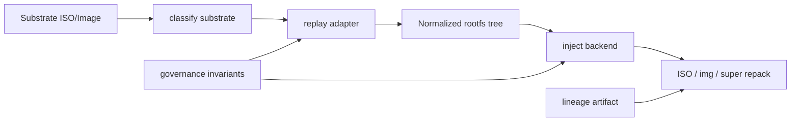

# Forge Universal Substrate Program — Windows, macOS, Android

Status: canonical expansion plan (P15 universal foundry tier).

Authority: `META_ARCHITECT_LAWBOOK.md`, `docs/forge-substrate-contract.md`, `docs/forge-rootfs-backend-contract.md`.

## Thesis

Forge already separates **replay substrate** (P10) from **rootfs backend** (P11). Windows, macOS, and Android do not break this model — they require new **replay adapters** and **inject backends**, not a new architecture.

| OS | Substrate shape | Replay adapter | Backend | Forge action |
|---|---|---|---|---|
| Windows | WIM/ESD + WinPE + BCD + NTFS | `windows-wim-layout` | `winpe-backend` | Extract WIM → inject drivers/config/registry |
| macOS | APFS + sealed snapshots + Installer.app | `macos-apfs-layout` | `darwin-backend` | Mount APFS → overlay LaunchDaemons/profiles |
| Android | super.img + boot/system/vendor | `android-super-layout` | `android-backend` | Unpack dynamic partitions → overlay/repack |

Linux replay **builds** rootfs; these platforms **extract + inject**. P11 backends for universal OS are inject-only.

## Phase map

| Phase | Scope | Deliverable |
|---|---|---|
| U1 | Contract + classification | Substrate registry entries, replay/backend registries, invariants JSON |
| U2 | Adapter modules | `windows-wim-layout`, `macos-apfs-layout`, `android-super-layout` |
| U3 | Inject backends | `winpe-backend`, `darwin-backend`, `android-backend` + chroot modules |
| U4 | Pipeline specs | Example YAML per platform with governance hooks |
| U5 | Proof + gates | Validators, unit tests, evolution ledger entries, Gate F invariant checks |

## Architecture



## Governance invariants (Gate F compatible)

| Platform | Required invariants |
|---|---|
| Windows | BCD integrity, signature preservation, boot chain order |
| macOS | APFS integrity, sealed snapshot verification, code signature preservation |
| Android | SELinux label consistency, vbmeta/avb awareness, slot metadata |

Recorded in `wolf-cog-os/forge/governance/substrate-invariants.json` and validated by `validate-substrate-invariants.py`.

## Host tooling matrix

| Adapter | Linux (WSL/CI) | Native host |
|---|---|---|
| windows-wim-layout | `wimlib-imagex` / `wimapply` | same + optional NTFS tools |
| macos-apfs-layout | contract stub (`dmg2img`, `apfs-fuse` optional) | `hdiutil`, `mount_apfs` |
| android-super-layout | `lpunpack`, `simg2img`, `unpack_bootimg` | same |

Adapters fail with actionable messages when tools are missing (`implementation_status: experimental` until boot-proven in CI).

## Pipeline examples

| Pipeline | Backend | Cloud outputs |
|---|---|---|
| `windows-installer.yaml` | winpe-backend | raw-img |
| `macos-installer.yaml` | darwin-backend | raw-img |
| `android-system.yaml` | android-backend | raw-img, qcow2 |

## Verification

```bash
python3 wolf-cog-os/scripts/validate-substrate-invariants.py --mode fail
python3 wolf-cog-os/scripts/validate-replay-adapter.py --mode fail
python3 wolf-cog-os/scripts/validate-rootfs-backend.py --backend winpe-backend --registry-only --mode fail
python3 -m unittest tests.test_universal_substrate
make forge-platform-gate
```

## Claim status

Universal substrate support is **asserted** at contract tier until cross-platform boot proof exists per `REPO_PROOF_LAW.md`.
