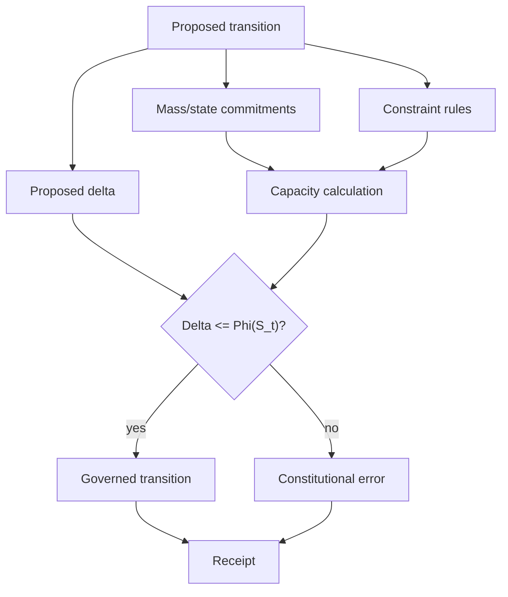
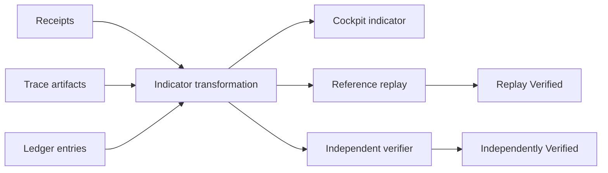
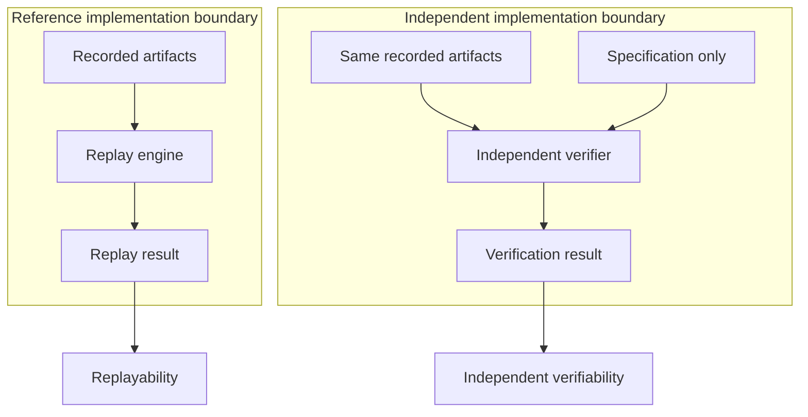
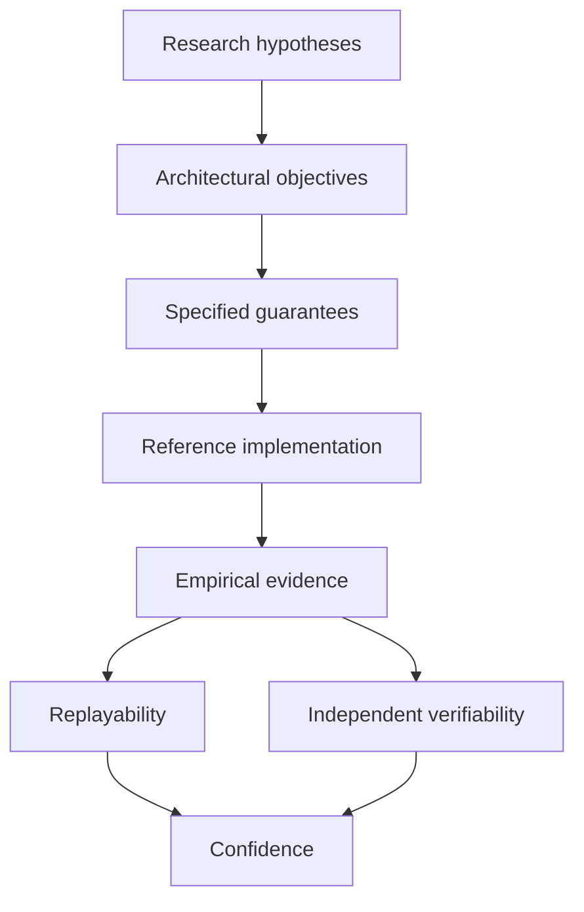
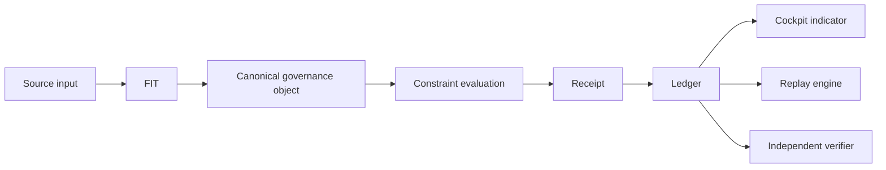
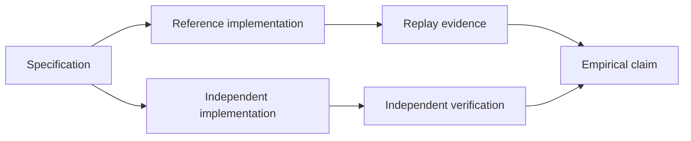

# Negotiant Core v1.1 Whitepaper

## Technical Canon: Universal Capacity, Governance, and Verification

**Status:** Draft canonical project document  
**Version:** 1.1  
**Scope:** Negotiant Core specification, constitutional mathematics, cockpit provenance, and reproducibility discipline

## Abstract

Negotiant Core v1.1 defines a constitutional mathematics for lawful continuation. It treats continuation as bounded by embodied limitation and lawful constraint, then binds that principle to runtime governance through receipts, validation layers, cockpit provenance, and reproducibility contracts.

Version 1.1 introduces an explicit epistemic frame. Architectural objectives, specified guarantees, empirical claims, and research hypotheses are no longer collapsed into one class of assertion. Replayability and independent verifiability are tracked separately. Cockpit indicators become provenance-carrying observations rather than implicit guarantees. The conclusion is therefore not a summary of claims, but a discipline statement: specifications define intended behavior, implementations demonstrate one realization, evidence establishes what has been achieved, and replication determines confidence.

## 1. Universal Capacity Relation

The foundational relation is:

```text
Phi(x) = C(x) - M(x)
```

Where:

| Symbol | Meaning |
|--------|---------|
| `Phi(x)` | Capacity or potential for continuation |
| `C(x)` | Constraint, the lawful boundary of movement |
| `M(x)` | Mass, the embodied limitation or inertia |

The potential for continuation equals constraint minus mass. Freedom is not infinite; it is what remains after the universe accounts for what is already bound and what is lawfully restricted.

Textual restatement:

```text
Mass defines constraint.
Constraint reduces lawful movement.
What remains is room for continuation.
```

In Negotiant Core and constitutional runtimes:

| Term | Governance reading |
|------|--------------------|
| Mass | Accumulated commitments, state, embodiment, or inertia |
| Constraint | Constitutional law and lawful transition boundaries |
| Continuation | Lawful evolution still available to the system |

`Phi(x)` measures how much lawful change remains possible after constraints and commitments are accounted for.

## 2. Claim Discipline

Version 1.1 adopts four epistemic categories.

| Category | Meaning | Required handling |
|----------|---------|-------------------|
| Architectural objective | What the system is designed to enable | State as design intent |
| Specified guarantee | What a conforming implementation must provide | Bind to normative text and conformance tests |
| Empirical claim | What has been demonstrated through evidence | Cite artifacts, receipts, tests, replay, or verification reports |
| Research hypothesis | What appears promising but remains under evaluation | Label as hypothesis and keep out of guarantee language |

No document may use a research hypothesis as a specified guarantee. No cockpit display may convert an observation into a guarantee without provenance and verification status.

## 3. Replayability and Independent Verifiability

Replayability means the reference implementation reproduces the same result from the same recorded evidence.

Independent verifiability means a separate implementation reaches the same result using only the specification and recorded artifacts.

These are distinct thresholds:

| Threshold | Boundary crossed | Evidence produced |
|-----------|------------------|-------------------|
| Replayability | Reference implementation reruns its own recorded evidence | Replay receipt, replay log, deterministic hash match |
| Independent verifiability | Separate implementation validates the result from spec and artifacts | Verification report, independent receipt, conformance result |

Replayability supports internal confidence. Independent verifiability supports external confidence.

## 4. Contribution Taxonomy

Negotiant Core v1.1 organizes its contributions as follows:

| Contribution | Scope |
|--------------|-------|
| Normative contribution | Constitutional specification, governance model, and architectural contracts |
| Engineering contribution | Runtime bindings, ledger semantics, receipts, cockpit indicators, CTS hooks, and tooling contracts |
| Research contribution | Hypotheses about paradox, faction translation, semantic boundaries, and lawful continuation |

## 5. Constitutional Mathematics

### 5.1 Mass

Mass is accumulated commitment. A system with mass has history, inertia, and obligations. In runtime terms, mass is represented by state, ledger entries, outstanding receipts, unresolved claims, pending commitments, and embodied resource limits.

### 5.2 Constraint

Constraint is lawful boundary. It is not merely prohibition; it is the structure that makes motion legible. In runtime terms, constraint is represented by constitutional rules, invariants, transition permissions, validation layers, and governance receipts.

### 5.3 Continuation

Continuation is lawful remaining motion. It is not unbounded freedom. It is residual capacity after mass and constraint are accounted for.

### 5.4 Universal Capacity Invariant

Invariant `NC-Phi.1 - Capacity for Lawful Continuation` makes the Universal Capacity Relation a concrete constitutional gate.

For any cosmos state `S_t`, the lawful capacity for continuation `Phi(S_t)` is:

```text
Phi(S_t) = C(S_t) - M(S_t)
```

Where:

| Functional | Meaning |
|------------|---------|
| `C(S_t)` | Constraint functional: current constitutional boundary, or how much lawful movement is permitted |
| `M(S_t)` | Mass functional: inertial load from accumulated commitments, tensions, and obligations |
| `Phi(S_t)` | Continuation capacity: remaining lawful room for evolution, motion, or negotiation |

The invariant requires:

```text
Phi(S_t) >= 0
```

If `Phi(S_t) < 0`, the cosmos is over-committed relative to its constitutional boundary and is in constitutional violation.

A conforming Negotiant Core runtime must not present continuation as unconstrained. Every continuation claim must identify:

1. Relevant mass or state commitments.
2. Applicable constraints.
3. Residual lawful movement.
4. Evidence or receipt supporting the calculation.

### 5.5 Concrete Cosmos Functionals

Assuming a cosmos model with zones, tension vectors, propagation links, paradox state, governance constraints, and active obligations, the mass functional is:

```text
M(S_t) =
  sum over z in Z of norm(T_z)
  + sum over o in Obligations(S_t) of w_o
```

Where `Z` is the set of zones, `T_z` is the tension vector in zone `z`, `norm(T_z)` is the specified L1, L2, or equivalent norm, `Obligations(S_t)` are active commitments, and `w_o` is the weight of obligation `o`.

The constraint functional is:

```text
C(S_t) =
  sum over z in Z of max_tension_z
  - sum over c in ActiveConstraints(S_t) of lambda_c
```

Where `max_tension_z` is the constitutional upper bound for zone `z`, `ActiveConstraints(S_t)` are currently binding constraints, and `lambda_c` is the strength or penalty of constraint `c`.

Mass is the loaded tension plus promises already inside the cosmos. Constraint is the lawful room before the cosmos reaches its constitutional walls.

### 5.6 coreTick Capacity Gate

`Phi` is a derived scalar over the cosmos. `coreTick` must constrain the proposed transition by comparing capacity with attempted change:

```text
Phi(S_t) >= Delta(S_t -> S_t+1)
```

Where `Delta(S_t -> S_t+1)` is the magnitude of attempted state change between ticks, such as tension delta, topology delta, or aggregate mutation measure.

Runtime rule:

```text
if Delta(S_t -> S_t+1) > Phi(S_t):
    reject transition
    raise ConstitutionalError("Transition exceeds lawful continuation capacity")
```

This creates a quantitative constitutional throttle on state evolution. It prevents runaway tension cascades, governance overreach, paradox storms, topology-adjacent drift, and any mutation that exceeds lawful capacity.

The v1.1 `coreTick` pipeline is:

```text
1. cloneCosmos()
2. assertTransitionInvariants()
3. computeContinuationCapacity()
4. computeProposedDelta()
5. assert(Delta <= Phi)
6. applyLocalTensionRules()
7. applyPropagationRules()
8. resolveParadoxEvents()
9. finalizeCosmos()
```

### 5.9.1 Paradox Resolution Specification

Paradox is a state where two or more lawful readings appear mutually incompatible under the current constraint frame.

The Paradox Resolution Specification defines the required handling:

| Step | Requirement | Receipt obligation |
|------|-------------|--------------------|
| Detect | Identify the incompatible claims, constraints, or interpretations | `paradox.detected` |
| Classify | Assign paradox type: semantic, procedural, constitutional, evidentiary, or temporal | `paradox.classified` |
| Bound | Define the lawful boundary inside which resolution may occur | `paradox.bounded` |
| Resolve | Apply a specified resolution rule or defer to governed negotiation | `paradox.resolved` or `paradox.deferred` |
| Record | Preserve inputs, rule table version, result, and unresolved residue | `paradox.receipt` |

Specified guarantee: a conforming implementation must never erase a paradox by silently selecting one side without a receipt.

Research hypothesis: negotiated paradox resolution may become more robust than fixed resolution tables in multi-agent systems. Version 1.1 records this as a hypothesis, not a guarantee.

## 6. Runtime Governance Model

The runtime evaluates proposed transitions against mass, constraints, receipts, and validation layers.



## 7. Evidence and Receipts

Every governed transition that affects continuation must emit a receipt containing:

| Field | Meaning |
|-------|---------|
| `input_id` | Stable identifier for the proposed transition |
| `mass_state` | Relevant commitments, state, or inertia |
| `constraint_basis` | Normative rule, invariant, or constitutional clause |
| `capacity_result` | Residual lawful continuation result |
| `continuation_capacity_t` | `Phi_t`, computed from `C(S_t) - M(S_t)` |
| `proposed_delta_t` | `Delta_t`, the attempted state-change magnitude |
| `capacity_check_passed` | Boolean result of `Delta_t <= Phi_t` |
| `decision` | Allow, deny, defer, challenge, or paradox |
| `implementation_version` | Runtime or rule-table version |
| `provenance` | Source artifacts used in the decision |
| `verification_status` | Pending, Replay Verified, Independently Verified, or Independently Replicated |

For `zoneTick` and `coreTick`, the ledger payload must include:

```text
continuation_capacity_t: Phi_t
proposed_delta_t: Delta_t
capacity_check_passed: boolean
```

`governanceTick` receipts must additionally include:

```text
epistemic_classification
grvl_signature
verification_status
```

`epistemic_classification` records whether the governed claim is an architectural objective, specified guarantee, empirical claim, or research hypothesis. `grvl_signature` records the Governance Receipt Validation Layer result and validator version.

## 8. Cockpit Indicator Provenance

Cockpit indicators are observational surfaces. They expose evidence; they do not create truth.

Each indicator must define:

| Requirement | Meaning |
|-------------|---------|
| Normative definition | Specification-level meaning of the displayed value |
| Reference implementation | Code path that computes the value |
| Independent verifier | Separate checker that can validate the value from artifacts |
| Source artifacts | Receipts, traces, ledger entries, tests, benchmark outputs |
| Transformation specification | Rule or algorithm mapping artifacts to the displayed value |
| Implementation version | Commit, build, package, or rule-table version |
| Verification status | Pending, Replay Verified, or Independently Verified |

NC-Phi.1 introduces three first-class cockpit indicators:

| Indicator | Normative meaning |
|-----------|-------------------|
| `indicator.continuation_capacity` | Current lawful continuation capacity, `Phi_t` |
| `indicator.capacity_utilization` | Ratio of proposed change to lawful capacity, `Delta_t / Phi_t`, with explicit handling for zero capacity |
| `indicator.capacity_risk_band` | Risk band derived from capacity utilization and verification status |



## 9. Governance Model and Authority Separation

Governance authority is separated from implementation execution. A runtime may produce receipts, but the Governance Receipt Validation Layer decides whether those receipts can be promoted into verified governance evidence.

### 9.4.1 Governance Receipt Validation Layer

The Governance Receipt Validation Layer verifies that a governance receipt is structurally valid, normatively grounded, and reproducible.

Validation stages:

| Stage | Requirement |
|-------|-------------|
| Shape validation | Receipt conforms to schema |
| Normative validation | Receipt cites a valid rule, invariant, or specification section |
| Epistemic classification validation | Claim role is recorded as architectural objective, specified guarantee, empirical claim, or research hypothesis |
| Provenance validation | Source artifacts exist and are content-addressable |
| Replay validation | Reference implementation can reproduce the decision |
| Independent verification | Separate verifier can validate from spec and artifacts |
| Independent replication | External replication package or report confirms the claim in a separate environment |

Specified guarantee: a receipt cannot be promoted to verified status without passing the relevant validation stage.

Every governance receipt must pass GRVL before it can support a Version 1.1 empirical claim.

## 10. Reproducibility Contract

### 10.1 Replayability

Reference replay must prove that the recorded artifacts are sufficient for the reference implementation to reproduce the same result.

### 10.2 Independent Verifiability

Independent verification must prove that the specification and recorded artifacts are sufficient for a separate implementation to reach the same result.

### 10.3 Independent Replication

Independent replication must prove that an external team or environment can reproduce the claim using the published specification, artifacts, and replication package. Replication is stronger than independent verification because it validates not only the result but the publishable evidence workflow.

The three evidence tiers are:

| Tier | Requirement |
|------|-------------|
| Replayability | Reference implementation replays the result from recorded artifacts |
| Independent verifiability | Separate implementation verifies the result from spec and artifacts |
| Independent replication | External team or environment reproduces the claim from the release package |

### 10.4 Verification Boundary



## 11. Epistemic Layer Diagram



The diagram is directional, not hierarchical. Hypotheses may motivate objectives, but only specified guarantees can bind conformance.

## 12. Security and Drift Resistance

Version 1.1 treats epistemic drift as a security concern. Epistemic drift occurs when a claim crosses categories without receipt-backed authorization, such as a research hypothesis being presented as a specified guarantee or replayability being presented as independent replication.

Drift resistance requirements:

| Drift type | Required defense |
|------------|------------------|
| Claim-category drift | GRVL validates epistemic classification |
| Reproducibility-tier drift | Replay, verification, and replication statuses remain separate |
| Indicator drift | Cockpit indicators carry provenance and verification status |
| Translation drift | FIT preserves source input and unresolved ambiguity |

Any change to epistemic classification rules, NC-Phi.1, GRVL, or FIT requires a governance receipt.

## 13. Versioning and Evolution Model

Versioning applies to normative text, reference implementation, evidence, and hypotheses separately.

| Role | Versioning rule |
|------|-----------------|
| Architectural objective | Versioned as design intent; does not imply conformance |
| Specified guarantee | Versioned normatively and tied to CTS or release gates |
| Empirical claim | Versioned with artifacts, receipts, replay, verification, or replication evidence |
| Research hypothesis | Versioned as research material and barred from guarantee language until promoted |

Semantic version changes must identify which role changed. A runtime patch, rule-table change, cockpit indicator change, or hypothesis promotion cannot share one undifferentiated version note.

## 14. Faces and Translation

Negotiant Core may present multiple faces: language, RPG, governance, scripture, cosmology, and other domain-specific surfaces. Faces are interpretive layers over the same receipt-grounded substrate.

### 14.8.1 Faction Input Translator (FIT)

The Faction Input Translator converts domain-specific or faction-specific input into canonical governance objects.

FIT obligations:

| Obligation | Meaning |
|------------|---------|
| Preserve source voice | Store the original faction input without overwriting it |
| Normalize structure | Map input to canonical claim, constraint, evidence, or transition forms |
| Declare translation rules | Identify translator version and rule table |
| Emit translation receipt | Record source, normalized output, confidence, and unresolved ambiguity |
| Preserve disagreement | Represent disagreement as structured evidence, not as malformed input |

Specified guarantee: FIT must not silently discard faction meaning. Ambiguity must be surfaced as provenance or paradox.

Research hypothesis: multi-face epistemic arbitration can improve governance when faces disagree, provided disagreement remains receipt-bound.

## 15. Version 1.1 Diagrams

### Provenance Flow



### Verification Boundary



## 16. Conclusion: Discipline Statement

Negotiant Core v1.1 does not ask the reader to accept an architecture because it is elegant. It asks the implementation to produce receipts, the cockpit to expose provenance, the verifier to cross implementation boundaries, and the theory to remain labeled until evidence supports promotion.

The discipline is:

```text
Specifications define intended behavior.
Implementations demonstrate one realization.
Evidence establishes what has been achieved.
Replication determines confidence.
Continuation remains lawful only where constraint and mass leave room for motion.
```
