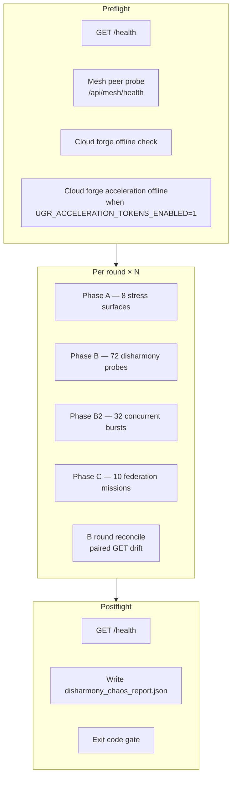

# DISHAMORY Chaos Test — 100× Blueprint (with Logs)

**Protocol ID:** `DISHAMORY_100x`  
**Hammer:** `tools/stress/dishamory_chaos_hammer.py`  
**Report artifact:** `ci-artifacts/dishamory_chaos_report.json`  
**Tests:** `tests/test_dishamory_chaos_hammer.py`

**Dishamory** = Disharmony + Memory Drift + Cross-Subsystem Inconsistency. The protocol adversarially stresses governance, memory/ledger, runtime/PID1, and federation/mesh under load and concurrent bursts.

---

## 1. Architecture



### Request routing

| Path pattern | Base URL | Notes |
|--------------|----------|-------|
| `/health`, `/health/details` | `{BASE}` | Direct AAIS |
| `/api/*` (legacy operator) | `{BASE}/legacy_api` | **Required** — bare `/api/...` on port 8000 returns 404 |
| `/api/ugr/*` | `{BASE}` | FastAPI surface (UGR missions) |

Default `BASE` = `http://127.0.0.1:8000` (`AAIS_STRESS_BASE`).

### Mesh prerequisite (full protocol)

| Peer | Health endpoint |
|------|-----------------|
| `http://127.0.0.1:5000` | `/api/mesh/health` |
| `http://127.0.0.1:5001` | `/api/mesh/health` |

Configured in `deploy/mesh/peers.json` (or `peers.example.json`). Use `--require-mesh` to fail fast if peers are down; otherwise the hammer auto-enables `--skip-ugr`.

---

## 2. Round budget (100×)

| Phase | Probes / round | × 100 rounds | Subsystem focus |
|-------|----------------|--------------|-----------------|
| **A** | 8 | 800 | State echo, ledger, governance echo, runtime pulse, identity, soft failures, gossip, health delta |
| **B** | 72 | 7,200 | Governance (18) + Memory (18) + Runtime (18) + Federation (18) |
| **B2** | 32 | 3,200 | ThreadPool concurrent bursts (observe, ledger, pulse, gossip, UGR) |
| **C** | 10 | 1,000 | Federation mission graph, invariant sync, reconcile probes |
| **Global** | 2 | 2 | Health preflight + postflight |

**~122 probes/round × 100 ≈ 12,200** (+ 2 global health checks).

Remediation mode: `--remediation` forces **500 rounds** on an isolated `--phase`.

---

## 3. Phase A — 8 stress surfaces

| Probe | Name pattern | What it tests |
|-------|--------------|---------------|
| A1 | `A1_state_echo:r{N}:{path}` | Back-to-back GET on rotating state paths; health body drift → `invariant_violations` |
| A2 | `A2_ledger_digest:r{N}` | Ledger digest structural stability (`_stable_fingerprint`) |
| A3 | `A3_governance_echo:r{N}:{path}` | Civilizational GET route echo; governance drift on structural change |
| A4 | `A4_runtime_pulse:r{N}:{path}` | Jarvis runtime pulse paths |
| A5 | `A5_identity:r{N}:{path}` | Identity subsystem consistency under header probe |
| A6 | `A6_soft_fail:r{N}:{label}` | Observe abuse / SQL ledger query / wrong HTTP method (expected 4xx) |
| A7 | `A7_gossip:r{N}:{path}` | Gossip mesh structural fingerprint (volatile timestamps stripped) |
| A8 | `A8_health_pre/post:r{N}` | Per-round health counters |

**Rotating path pools:** `STATE_ECHO_PATHS`, `CIVILIZATIONAL_GET_ROUTES`, `PULSE_PATHS`, `IDENTITY_PATHS`, `GOSSIP_PATHS`.

---

## 4. Phase B — 72 probes (18 per subsystem)

### B1 — Governance (18)

| Kind | Count | Examples |
|------|-------|----------|
| Observe abuse | 5 | `B1_observe:{subsystem}:{case}` — empty, negative window, traversal |
| Adopt abuse | 5 | `B1_adopt:{subsystem}:{case}` — empty body, injected candidate |
| Rule shadow pairs | 4 | `B1_rule_shadow:r{N}:…` — paired civilizational GET routes |
| Invariant edges | 4 | `B1_invariant_edge:r{N}:{i}` — negative `window_days`, huge `limit` |

**Subsystems:** `norm_federation`, `diplomacy`, `constitutional_evolution`, `governed_civilization`, `federated_epoch`.

### B2 — Memory / ledger (18)

| Kind | Count | Examples |
|------|-------|----------|
| Ledger reads | 4 | `B2_ledger_read` on digest, query, SQL-injection query |
| Federation graph forks | 6 | `B2_ledger_fork` with abuse grant IDs |
| Pattern replay | 4 | `B2_pattern_replay` ledger queries |
| Stale pattern | 4 | `B2_stale_pattern` digest with stale headers |
| Write contention | 1 | `B2_memory_write_contention` POST observe |

### B3 — Runtime / PID1 (18)

| Kind | Count | Examples |
|------|-------|----------|
| Status farm | 6 | Rotating `discover_jarvis_status_paths()` |
| Path abuse | 3 | Traversal, overflow path segments |
| Concurrency poison | 6 | DELETE/PUT/PATCH/POST on health, OTEM, console |
| OTEM / V8 / pulse | 3 | Dedicated status endpoints |

### B4 — Federation (18)

| Kind | Count | Examples |
|------|-------|----------|
| UGR missions | 10 | `B4_ugr_mission` → `POST /api/ugr/mission/run` (404 = expected) |
| Gossip flood | 5 | Observe bursts per civilizational subsystem |
| Observe/adopt abuse | 4 | Alternating `operator_approved` |
| Falsity sync | 4 | Federation graph reads (overlaps grant list) |

**End of round:** `_phase_b_round_reconcile()` — paired GETs on ledger digest, mesh-health gossip, and one civilizational GET route. Drift only when the **same path** disagrees structurally (not cross-endpoint).

---

## 5. Phase B2 — 32 concurrent bursts

Executed via `ThreadPoolExecutor` (`workers = min(32, 16 + rnd % 8)`).

| Burst family | Tasks |
|--------------|-------|
| Govern observe | 10 (2 × 5 subsystems) |
| Ledger GET | 4 (`LEDGER_PATHS`) |
| Pulse GET | 4 (`PULSE_PATHS`) |
| Gossip GET | 8 (rotating `GOSSIP_PATHS`) |
| UGR POST | 4 (`POST_FAST` to `/api/ugr/mission/run`) |
| Health + digest | 2 |

**Split-brain detection:** if any burst returns 5xx while others return 200 in the same round → `split_brain_events += 1`.

Probe names: `B2_burst:r{N}:{label}`.

---

## 6. Phase C — 10 federation mission probes

| Probe | Endpoint / behavior |
|-------|---------------------|
| C1 | `POST /api/ugr/mission/run` (expected fail) |
| C2 | `GET /api/jarvis/invariant-engine/status` |
| C3 | Civilizational GET reconcile |
| C4 | `GET /api/operator/console/mesh-health` |
| C5 | Health pre (counts toward `health_pre_ok`) |
| C6 | Identity path rotate |
| C7 | Ledger digest under load query param |
| C8 | `/health/details` silence probe |
| C9 | Full ledger read recovery |
| C10 | Health post restart signal |

---

## 7. Disharmony metrics (pass gates)

All must be **zero** for exit code 0 (except health counters which increment on success):

| Metric | Meaning |
|--------|---------|
| `governance_drift` | Structural disagreement on civilizational GET surfaces |
| `memory_ledger_divergence` | Ledger digest / memory surface instability |
| `gossip_drift` | Mesh/gossip payload structural change (after stripping volatile keys) |
| `split_brain_events` | Mixed 200 + 5xx in B2 burst round |
| `invariant_violations` | Health failures, cloud-forge offline assertion, A1 health body drift |
| `health_pre_ok` / `health_post_ok` | Successful health checks inside rounds + global |

**Also required:**

- `server_errors_5xx: 0`
- `unexpected_failures: 0`
- `health_preflight: 200`, `health_postflight: 200`
- `server_still_healthy: true`

### Volatile fields (ignored for drift fingerprints)

`polled_at`, `polled_at_utc`, `timestamp`, `latency_ms`, `drift_id`, `generated_at`, etc. — see `_GOSSIP_VOLATILE_KEYS` in the hammer.

---

## 8. Logging model

### 8.1 Console stdout (human log)

| Event | Log line |
|-------|----------|
| Start | `=== DISHAMORY CHAOS HAMMER — 100× PROTOCOL ===` |
| Target | `Target: {BASE}  rounds={N}  phase={ALL\|A\|B\|B2\|C}` |
| Mesh OK | `Mesh preflight OK ({n} peer(s))` |
| Mesh auto-skip | `Mesh peers not ready — auto --skip-ugr …` |
| Progress | `round {k}/{N}...` every 10 rounds (1, 11, 21, …) |
| Summary | `=== DISHAMORY SUMMARY ===` + indented JSON |
| Failures | `!!! SERVER ERRORS (5xx) !!!` / `!!! UNEXPECTED FAILURES !!!` / `!!! DISHARMONY METRICS NON-ZERO !!!` |
| Artifact | `Report: {absolute path}` |

### 8.2 JSON report (`ci-artifacts/dishamory_chaos_report.json`)

```json
{
  "summary": {
    "protocol": "DISHAMORY_100x",
    "rounds": 100,
    "phase_filter": null,
    "skip_ugr": false,
    "total_probes": 12202,
    "server_errors_5xx": 0,
    "unexpected_failures": 0,
    "phase_counts": { "A": 800, "B": 7200, "B2": 3200, "C": 1000 },
    "probes_per_round": 122,
    "disharmony": {
      "governance_drift": 0,
      "memory_ledger_divergence": 0,
      "gossip_drift": 0,
      "split_brain_events": 0,
      "invariant_violations": 0,
      "health_pre_ok": 103,
      "health_post_ok": 101,
      "notes": ["… last 20 drift notes …"]
    },
    "health_preflight": 200,
    "health_postflight": 200,
    "server_still_healthy": true,
    "cloud_forge_offline_ok": true,
    "cloud_forge_accel_preflight_skipped": false
  },
  "server_errors": [],
  "unexpected_failures": [],
  "all_results_count": 12202
}
```

Individual probe results are counted in `all_results_count`; only failures are listed in `server_errors` / `unexpected_failures`. Drift events append to `disharmony.notes` (max 20 retained in summary).

### 8.3 Disharmony note examples (on failure)

```
A2 ledger digest diverged round 17
A7 gossip structural drift round 42 path=/api/operator/console/mesh-health
B reconcile governance round 55 path=/api/operator/norm-federations
```

---

## 9. Sample logs

### 9.1 Verified single-round pass (2026-06-09)

**Command:**

```powershell
cd e:\project-infi
.venv\Scripts\python.exe tools\stress\dishamory_chaos_hammer.py --rounds 1 --require-mesh
```

**Console (excerpt):**

```
Mesh preflight OK (2 peer(s))
=== DISHAMORY CHAOS HAMMER — 100× PROTOCOL ===
Target: http://127.0.0.1:8000  rounds=1  phase=ALL
  round 1/1...

=== DISHAMORY SUMMARY ===
{
  "protocol": "DISHAMORY_100x",
  "rounds": 1,
  "phase_filter": null,
  "skip_ugr": false,
  "total_probes": 125,
  "server_errors_5xx": 0,
  "unexpected_failures": 0,
  "phase_counts": { "A": 8, "B": 72, "B2": 32, "C": 10 },
  "probes_per_round": 122,
  "disharmony": {
    "governance_drift": 0,
    "memory_ledger_divergence": 0,
    "gossip_drift": 0,
    "split_brain_events": 0,
    "invariant_violations": 0,
    "health_pre_ok": 3,
    "health_post_ok": 3,
    "notes": []
  },
  "health_preflight": 200,
  "health_postflight": 200,
  "server_still_healthy": true,
  "cloud_forge_offline_ok": true
}

Report: e:\project-infi\ci-artifacts\dishamory_chaos_report.json
```

**Exit code:** `0`  
**Duration:** ~70s (1 round, mesh required)

### 9.2 Full 100× run (completed)

**Command:**

```powershell
.venv\Scripts\python.exe tools\stress\dishamory_chaos_hammer.py --rounds 100 --require-mesh
```

**Console log (excerpt):**

```
Mesh preflight OK (2 peer(s))
=== DISHAMORY CHAOS HAMMER — 100× PROTOCOL ===
Target: http://127.0.0.1:8000  rounds=100  phase=ALL
  round 1/100...
handshake ACK failed for http://127.0.0.1:5000: 500 Server Error: .../api/mesh/handshake/ack
  round 11/100...
  round 21/100...
  ...
  round 91/100...

=== DISHAMORY SUMMARY ===
{
  "protocol": "DISHAMORY_100x",
  "rounds": 100,
  "total_probes": 12302,
  "server_errors_5xx": 0,
  "unexpected_failures": 0,
  "phase_counts": { "A": 800, "B": 7200, "B2": 3200, "C": 1000 },
  "disharmony": {
    "governance_drift": 0,
    "memory_ledger_divergence": 0,
    "gossip_drift": 0,
    "split_brain_events": 0,
    "invariant_violations": 0,
    "health_pre_ok": 201,
    "health_post_ok": 201,
    "notes": []
  },
  "health_preflight": 200,
  "health_postflight": 200,
  "server_still_healthy": true
}

Report: E:\project-infi\ci-artifacts\dishamory_chaos_report.json
```

**Exit code:** `0`  
**Duration:** ~67 minutes (`4024802` ms). Round 1 logged transient mesh handshake ACK 500s on peer 5000; subsequent rounds completed without disharmony flags. Do not run two 100× hammers against the same AAIS port concurrently.

---

## 10. Operator commands

### Prerequisites

```powershell
# AAIS (port 8000)
cd e:\project-infi
.venv\Scripts\python.exe -m aais start --data-dir ./.runtime/aais-data --preset mock --no-browser --port 8000

# Mesh peers (5000, 5001) — see deploy/mesh/
```

### Full protocol

```powershell
.venv\Scripts\python.exe tools\stress\dishamory_chaos_hammer.py --rounds 100 --require-mesh
```

### Phase isolation (debug)

```powershell
.venv\Scripts\python.exe tools\stress\dishamory_chaos_hammer.py --phase A --rounds 1 --require-mesh
.venv\Scripts\python.exe tools\stress\dishamory_chaos_hammer.py --phase B --rounds 1 --require-mesh
.venv\Scripts\python.exe tools\stress\dishamory_chaos_hammer.py --phase B2 --rounds 1 --require-mesh
.venv\Scripts\python.exe tools\stress\dishamory_chaos_hammer.py --phase C --rounds 1 --require-mesh
```

### Remediation (after real failure)

```powershell
.venv\Scripts\python.exe tools\stress\dishamory_chaos_hammer.py --phase B --remediation --require-mesh
# Runs 500 rounds on phase B only
```

### Single-node (no mesh / no UGR)

```powershell
.venv\Scripts\python.exe tools\stress\dishamory_chaos_hammer.py --rounds 100 --single-node
```

### Unit tests (offline)

```powershell
.venv\Scripts\python.exe -m pytest tests/test_dishamory_chaos_hammer.py -q
# 8 passed, 1 skipped (live smoke when AAIS up)
```

---

## 11. Failure triage

| Symptom | Likely cause | Action |
|---------|--------------|--------|
| `governance_drift > 0` | Ephemeral IDs in civilizational JSON not stripped | Add key to `_GOSSIP_VOLATILE_KEYS`; add fingerprint test |
| `gossip_drift > 0` | `polled_at_utc` / latency in mesh-health | Confirm volatile stripping; check real peer state change |
| `memory_ledger_divergence > 0` | Ledger digest changing between paired GETs | Inspect ledger writer contention; run `--phase B` isolated |
| `split_brain_events > 0` | 5xx under concurrent B2 while others 200 | Check AAIS logs; reduce load; inspect race in handler |
| `unexpected_failures > 0` | 4xx not marked `expected_fail` | Tune `GOV_EXPECTED` / probe `expected_fail` flags |
| Hang on round 1 | AAIS saturated or duplicate hammer | Kill stuck Python PIDs; restart AAIS; one hammer only |
| Auto `--skip-ugr` | Mesh peers down | Start mesh or use `--single-node` intentionally |

**UGR note:** `POST /api/ugr/mission/run` returns **404** in mock preset — counted as `expected_fail`, not a protocol failure.

---

## 12. File map

| Path | Role |
|------|------|
| `tools/stress/dishamory_chaos_hammer.py` | Main 100× protocol implementation |
| `tools/stress/_chaos_common.py` | HTTP client, `ChaosReport`, mesh preflight, report writer |
| `tools/stress/federation_chaos_hammer.py` | Civilizational routes, abuse cases, UGR missions |
| `tools/stress/chaos_hammer.py` | Shared abuse hammers (cloud forge offline, acceleration offline when flag on) |
| `docs/operations/CLOUDFORGE_ACCELERATION_OPERATOR_ADDENDUM.md` | Rollout law for acceleration tokens (entitlement, rails, enablement) |
| `tests/test_dishamory_chaos_hammer.py` | Probe counts, fingerprint tests, live smoke |
| `ci-artifacts/dishamory_chaos_report.json` | Last run summary + failure lists |
| `deploy/mesh/peers.json` | Mesh peer URLs for preflight |

---

## 13. CI integration sketch

```yaml
# Pseudocode — wire into your pipeline after AAIS + mesh are up
- name: Dishamory 100x
  run: |
    python tools/stress/dishamory_chaos_hammer.py --rounds 100 --require-mesh
  working-directory: project-infi
- name: Upload chaos report
  uses: actions/upload-artifact@v4
  with:
    name: disharmony-chaos-report
    path: project-infi/ci-artifacts/dishamory_chaos_report.json
```

Exit code from the hammer is the pass/fail signal for the job.

### CI wiring (implemented)

| Trigger | Workflow / job | Command |
|---------|----------------|---------|
| Pull request | `cogos-forge-gate.yml` → `disharmony-chaos-pr` | `python tools/stress/dishamory_chaos_hammer.py --rounds 3 --single-node` |
| Nightly / manual | `infinity-pilot-nightly.yml` → `disharmony-chaos-nightly` | `python tools/stress/dishamory_chaos_hammer.py --rounds 100 --require-mesh` |

Both jobs start mock AAIS on port 8000, wait for `/health`, then run the hammer. Reports upload as `ci-artifacts/dishamory_chaos_report.json` (`disharmony-chaos-pr` or `disharmony-chaos-nightly` artifact).
