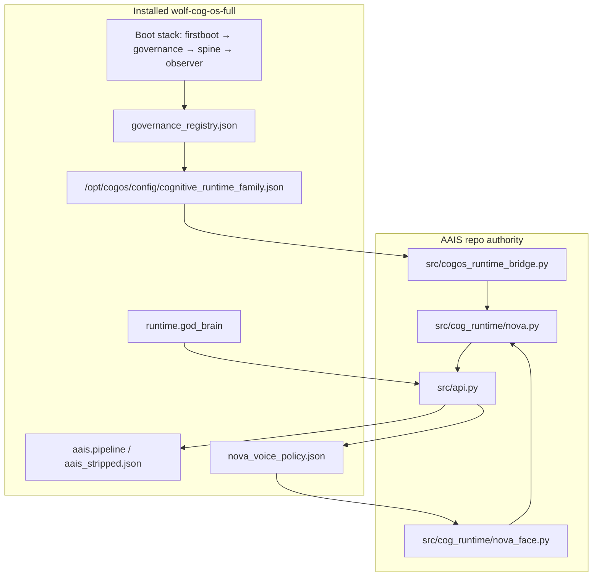
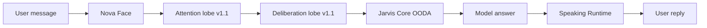

# Nova Cortex — Wolf CoG OS Integration

Canonical Nova Cortex constitution: [NOVA_CORTEX.md](./NOVA_CORTEX.md)

This document maps **Nova Cortex** onto **wolf-cog-os-full** — boot stack, payload config,
bridge code, and turn-time AAIS integration.

## Architecture



## Turn-time pipeline (companion / cognitive mode)



| Stage | Wolf / AAIS seam | Artifact |
|-------|------------------|----------|
| Nova Face | `nova_voice_policy.json`, companion profiles | `nova_face` envelope |
| Attention | `cognitive.attention` in cortex manifest | `focus_artifact` |
| Deliberation | `cognitive.deliberation` + optional LLM | `decision_object` |
| Jarvis Core | `god_brain.json`, `aais_stripped.json` | OODA packet, routing |
| Speaking | Speaking Runtime spec | narrated reply |

## Boot stack (8 artifacts)

Defined in [wolf-cog-os/scripts/lib/cogos-systemd-stack.sh](../../wolf-cog-os/scripts/lib/cogos-systemd-stack.sh):

1. `cogos-firstboot.service`
2. `cogos-governance.service`
3. `cogos-spine.service`
4. `cogos-observer.service`
5. Four substrate drop-ins (accounts-daemon, dbus, logind, polkit)

Boot establishes governance and substrate law. Nova Cortex turn logic runs in AAIS/Jarvis, not in PID1.

## Config paths and loaders

| Concern | Path | Loader |
|---------|------|--------|
| Nova Cortex manifest | `/opt/cogos/config/cognitive_runtime_family.json` | `runtime.cognitive_runtime_family` |
| God Brain / routing | `config/god_brain.json` | `runtime.god_brain` |
| AAIS pipeline | `config/aais_stripped.json` | `aais.pipeline` |
| Nova voice / face policy | `config/nova_voice_policy.json` | `runtime.voice_policy` |

Registry authority: [governance_registry.json](../../wolf-cog-os/payload/opt/cogos/memory/backups/bundle-20260526-034252-operator/config/governance_registry.json)

## Repo bridge

| Component | Role |
|-----------|------|
| [src/cogos_runtime_bridge.py](../../src/cogos_runtime_bridge.py) | Load manifest, resolve runtimes, build turn envelope |
| [src/cog_runtime/nova_face.py](../../src/cog_runtime/nova_face.py) | Face → Cortex → Jarvis binding |
| [scripts/cogos/export-cognitive-runtime-family.sh](../../scripts/cogos/export-cognitive-runtime-family.sh) | Export manifest from repo to wolf payload |

```bash
# Export manifest into wolf payload
bash scripts/cogos/export-cognitive-runtime-family.sh

# Bridge spec
python -m src.cogos_runtime_bridge --spec

# Validate installed manifest
python -m src.cogos_runtime_bridge --validate-config wolf-cog-os/payload/opt/cogos/config/cognitive_runtime_family.json
```

## Verify gate

[wolf-cog-os/scripts/verify-full-runtime-release.sh](../../wolf-cog-os/scripts/verify-full-runtime-release.sh) checks:

- `cognitive_runtime_family.json` present in payload
- `src.cogos_runtime_bridge` importable with `family_id: nova.cortex`

## Release manifest stamping

[wolf-cog-os/scripts/lib/update-full-runtime-manifest.sh](../../wolf-cog-os/scripts/lib/update-full-runtime-manifest.sh) sets:

- `components.nova_cortex`
- `components.cognitive_runtime_family`
- `components.cognitive_runtime_bridge`

## Claim status

Integration described here: **asserted** (repo tests + payload verify gate).

Cross-machine wolf-cog-os-full boot with live Nova companion turn: **not yet proven**.

See [FAMILY_V1_1_PROOF_BUNDLE.md](../proof/cognitive_runtime/FAMILY_V1_1_PROOF_BUNDLE.md).
